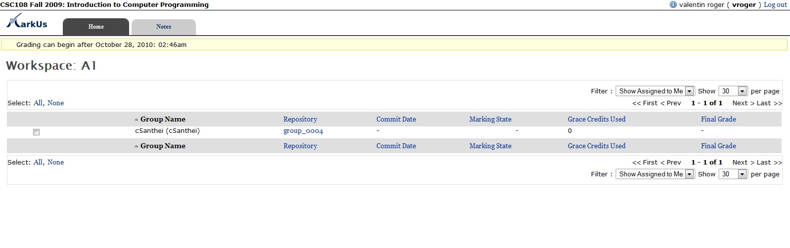

================================================================================
Documentation for the Grader
================================================================================

.. contents::

In this note, we will see the rights reserved for the examiners. We recommend
to the examiners to use preferentially to the browser FireFox to use MarkUs.

Please note: *the administrators can naturally play the role of assessors. The
approach is similar to that for a “simple" examiner.* 

Once connected to MarkUs, the examiner is welcomed in the software and sees the
panel of the different projects he can correct. It supposes obviously that one
(or some) project(s) has been created and configured by the administrator /
responsible for subject.

As a convention, projects are presented like that : {Course acronym}-{TP or
TA}-{Group Number}.

In the following example, the teacher has to correct the TP (practical class)
of MELOG #1 made by the group of tutorial classes #6 (that will be the
MELOG-TP1-06 project). It implies that the administrator has assigned the
teacher as examiner of the various subgroups of this project. If the teacher
does not see any subgroup, then he will have to contact the person in charge of
the course to ask for this affectation. 

   Welcome Page for the Grader

Start an evaluation session 
--------------------------------------------------------------------------------
From the welcome screen, the examiner chooses the project he has to correct.
Once he has selected a project, he finds the list of the projects delivered by
the pupils.  If the release deadline of the project is not expired yet, then a
message indicates him/her *the moment from which the session of evaluation can
begin.*

Given that students can submit new versions of their work until
deadline, it is obviously advisable not to begin the evaluation before this
date.

When the release deadline of the work expires, the examiner can correct
the code returned by each subgroup.

To begin to correct the work of a subgroup, two choices are proposed to the
assessor: 

*  If the examiner wants to get back the work deposited by the students
   before the deadline of the work (and then ignore the pupils who has submitted
   their work after that deadline), you have to click on the name of the subgroup
   (column "Name of the group "). After that, you have to click again on the name
   of the subgroup (column «Name of the group "). Then, MarkUs will redirect the
   examiner to the screen allowing to annotate the submitted code; 
   
*  If the examiner wants to navigate in the various submissions of the students
  (and, for example, consider a work given after the deadline you have to click
  on the identifier (column "Directory") of the subgroup in question. The
  software redirects you to a page which recapitulates the files submitted by
  the subgroup of students.  If you look the box "Find another revision" you
  will see whether the students chose to complete their work after the
  deadline. It is important to note that the examiner can navigate within the
  various submissions made by the subgroup (with the box "Find another
  revision"). Then this feature lets the freedom to the examiner to correct the
  last version of the work handed by the pupils with educational purposes,
  while applying automatically the penalties of delay defined by the
  administrator. In order to correct the work before the deadline, just select
  the last version before this date. To start the evaluation of the work
  returned by the selected subgroup, click on "Get back and estimate this
  revision ".

   Dashboard for the Grader

Remark: on the screen which recapitulates the various versions deposited for a
project, the field " Name of the group " is followed by one or several logins,
corresponding to the students who validated their membership common to a
subgroup. It is possible that, due to the lack of time, one of the members of a
subgroup did not connect to MarkUs to make this administrative validation. In
that case, the submission is considered as valid, but the login does not appear
to this level of the summary.

.. figure:: images/Doc_Grader_ViewRevision.jpg
   :width: 1599px
   :height: 549px
   :scale: 100%
   :align: center
   :alt: View Revisions

   View Revisions

*Please note*: if the examiner had previously begun the evaluation of the
subgroup and would like to resume its work, it is essential not to re-launch a
session of "recovery" of the work of the pupils! Indeed, the examiner would
lose then the previous note deposited on the work of this subgroup. We will
explain how to resume an evaluation and to complete it.

   Pop Up before collecting documents

Once the session of evaluation is started, the examiner consults the various
files submitted by the subgroup of students (with the line "Sent File"). 

And, naturally, he can annotate the code: select a portion of code, and click
on "New Note" to add a specific note which is not a part of the comments
prerecorded by the administrator, or to navigate in the prerecorded categories
of note and to click the considered note.

   Annotation Categories seen by the Grader

Then, by clicking on “Note List”, it is possible to overview directly all the
written notes of the homework, and put a global appreciation. 

   Annotation List during the grading

Resume an evaluation session
--------------------------------------------------------------------------------
For various reasons, the examiner can be interrupted in its correction of a
subgroup, and wish to resume it later. It is possible while notes were not made
public yet. 

For that purpose, it is necessary to return to the recapitulative
screen of the various submissions (tab "Sendings"). And click, this time, on
the name of the subgroup (column "Group Name") and not on the identifier
(column "Directory") of the subgroup in question. The examiner finds the notes
previously organized and can pursue its work.

   Resume an evaluation session

Finish an evaluation session
--------------------------------------------------------------------------------
When the examiner ended to evaluate the work of a subgroup, he has to modify
the "State of the evaluation". In this screen " State of the evaluation ",
choose "complete".

Only the administrator can, finally, reveal the notes of the students.

   Marking state

Annotate PDF documents
--------------------------------------------------------------------------------
Let us end on a remark which illustrates all the potential of MarkUs: it is
possible to annotate not only of the source code, but also PDF files submitted
by the students on the software!  It is an extremely useful feature which
allows estimating diagrams of class, algorithms handed by the pupils, ...

However, in the current version of MarkUs, it is advisable to ban the PDF files
with more than thirty pages. Last limit: annotating PDF documents does not
allow using, in the current version of the software, the categories of notes
defined by the examiner.

But the individual notes are obviously possible. It is necessary to select the
zone concerned and, then, to write a note down. A powerful asset for the
generalization of MarkUs in the other teachings !

   PDF annotations

Get back the work of a subgroup to test it on his machine
--------------------------------------------------------------------------------
MarkUs does not allow yet executing directly tests via the Web interface (it is
a feature in progress).  The examiner can nevertheless get back the work of a
subgroup of students to test it on his machine. The solution consists in
downloading the wished file(s) one by one, since the interface of code note.
Just click on"Download". It is possible to get back already left notes by
checking the button "Add notes". In that case, notes will appear as comments in
the code got back via MarkUs.
