================================================================================
Documentation for the Student
================================================================================

It allows any user which is pre-registered to connect, either as a student, as
a marker or as an administrator. In this post we will especially see the
student rights. At this level, we describe what allows MarkUs before and after
evaluation by the grader. Once connected to Markus, the student has access
to the software and see the panel of various projects that he can take part in
/ he has already participated. This assumes that a project has been previously
created and configured by the administrator / manager of material. 

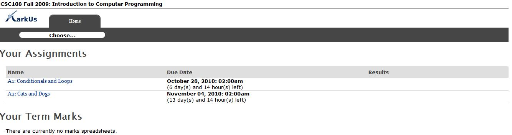

   Student HomePage

Submitting a homework
--------------------------------------------------------------------------------

From this web homepage, the student has to choose the project in which he will
take part. Then a summary of the work is presented to him — especially the
tasks to accomplish, and the different files to send before a specified
deadline. The mount of students required for each subgroup is also clearly
indicated.  The student has moreover the possibility to “Work alone” or to
“Create” his own subgroup:

* In order to work alone, the student has to click on the “Work alone” link.
* In order to work as a team member, the student has to: Click on “Create”, And
  give the login(s) of the other student(s) via the “Invite” link.  Each
  invited student must connect himself on MarkUs to accept the invitation.
  Nevertheless, as soon as a student invited enough persons so that the
  subgroup is considered as valid, he can begin to send his code (in case one
  of the members of the subgroup shall not accept the invitation immediately).
  The submission will then be made well in the name of the subgroup.

Once the subgroup of pupils is constituted, new tabs appear on the screen:

* "Send" allows to submit files;

* "Results" will allow, later, getting back the mark and the notes left by
  the practical class examiner.

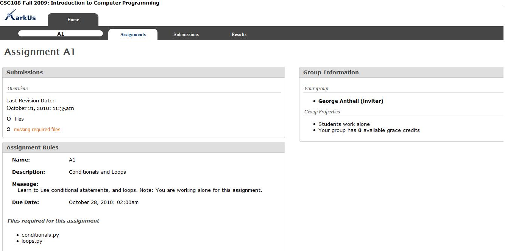

   Assignment properties once you have a group
 
In order to submit the files required for the assignment, you need to choose
the section «Submissions». This will open the File Manager of the assignment
you want to submit your files for. This File Manager shows you not only the
files you already submitted but also those one you need to send in order to
complete the assignment. 

In order to submit a new file, choose the tag”Add new” and then indicate the
position of the file on your disk and click”Submit”. The name of the file you
want to submit absolutely has to be the same that the name of the file
required. 

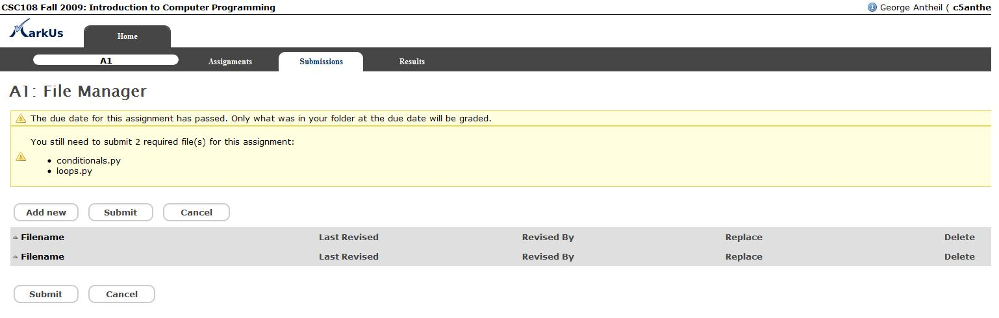

   File Manager with required files

If the file has been successfully submitted it will appear in the
File Manager.

Of course, if you want to modify the file you want to submit or submit a new
version, it's possible using the function “Replace”.

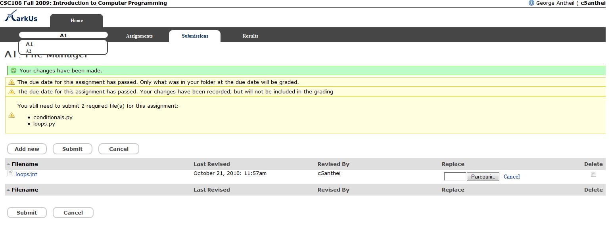

   File Manager validation changes

**A submission will be taking in account in MarkUs even if all the files required
have not been submitted. After the deadline, the last version of the files
submitted before this date will be evaluated(it's possible to submit after).**
The grader can annotate the version he wants.

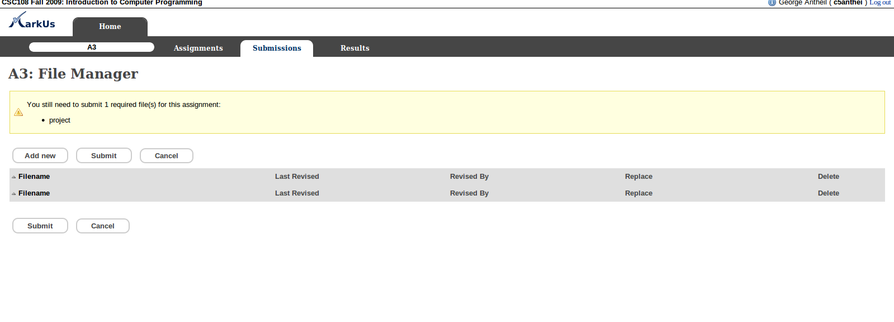

   File Manager when no file has been submitted

Correction 
--------------------------------------------------------------------------------

As we previously said, MarkUs screen allows the student to see a list of the
different projects he may join/has joined. Once a project has been corrected,
global appreciation is displayed (it is sometimes useful to ignore the “Mark”
section, since some works has no mark for certain curses). To access the
detailed results, click on “Results”. After that, the student may see the
different files he submitted and, by pointing the selected text, look at the
commentaries let by the teacher.

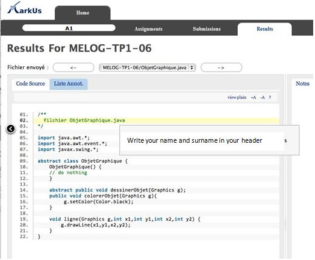

   Page seen by the student once marks have been released

Submitting remark requests
--------------------------------------------------------------------------------

If the instructor has allowed students to submit remark requests on an
assignment, a "Remark Request" tab will be shown when clicking on "Results."
This tab will show instructions on what the remark request should contain, as
well as any due dates.  Students can write their request in the text box, and
choose to either "Save" (and come back later to continue editing) or "Submit."

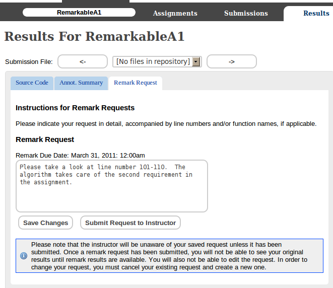

   Remark request tab seen by the student once marks have been released

*It is important to note that the instructor will be unaware of any remark
requests until it has been submitted.  Once a remark request has been
submitted, students will not be able to edit their request.  Students will
also be unable to view original marks until remark results have been
released by the instructor.

When the student chooses to submit the remark request, the student will see
a pop-up confirming the submission.

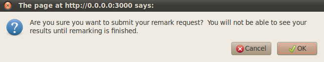

   Remark request submission confirmation pop-up

When the student clicks "Ok," the screen will change to show that the
remark request has been submitted.  The student will be able to see the
request details. The student can also choose to cancel the remark
request.

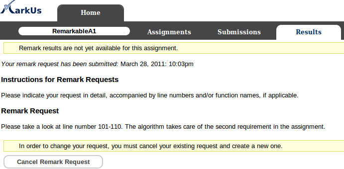

   The screen that students will see upon remark request submission

When the remarked results have been released by the instructor, the
student can click on the results tab to view any comments and changes
made.  They will be able to see the old marks and the new marks in the
marks tab.

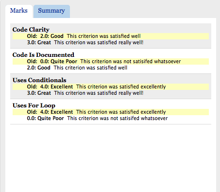

   The tab containing old and new marks

The summary tab will show the summary of the new marks.

.. figure:: images/Doc_Student_Remarks_Summary.png
   :width: 450px
   :height: 420px
   :scale: 100%
   :align: center
   :alt: Remarks new marks summary

   The tab containing new summary of marks

The old marks summary can be viewed upon hovering over the "Show Old
Mark Summary" link.

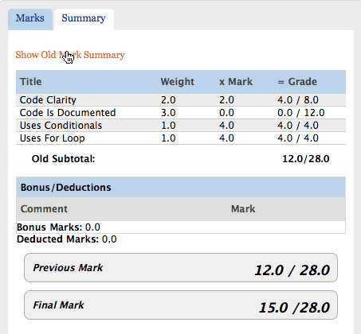

   The tab containing old summary of marks on mouseover
