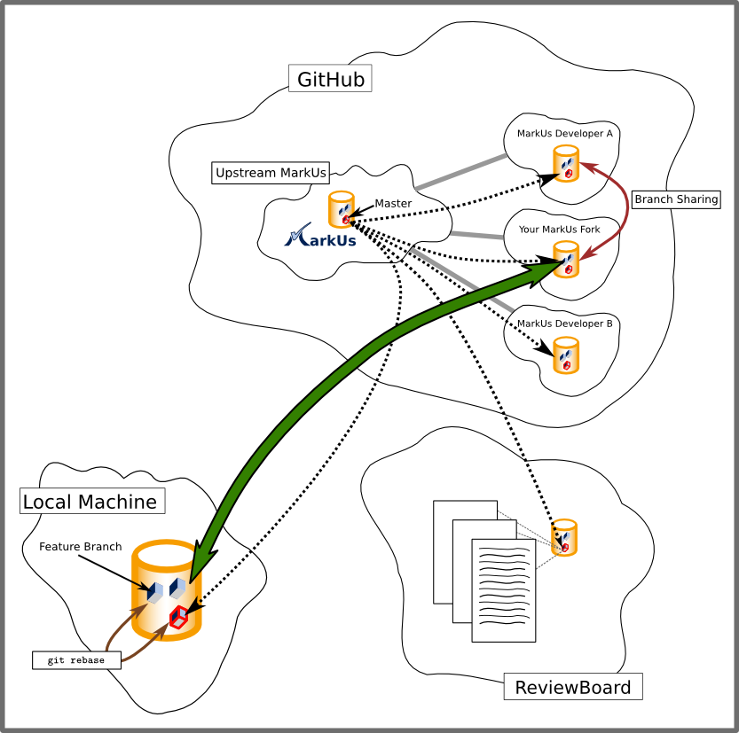

================================================================================
MarkUs, Git and Github: How it Works
================================================================================

.. contents::

Overview
================================================================================

Note that the following few paragraphs might be a bit confusing. Hang in there,
there are always people around you can ask.

MarkUs Development Workflow
--------------------------------------------------------------------------------

The steps involved until your code ends up in the main MarkUs Git repository
are the following:

1. Create feature branch based on up-to-date local master branch

2. Develop and commit (small commits are beatiful) on your feature branch

3. Once an early version of your code is ready upload the diff onto Review
   Board and push your feature branch to your Github fork

4. Get code reviewed, fix (i.e. repeat step 2-4 as needed)

5. Once you have a ship-it, create a pull-request on Github

6. Wait until a core MarkUs developer gets your code merged (you should see
   commit emails on markus-dev once that has happened)

More on those steps below.

The Three MarkUs Git Repositories
--------------------------------------------------------------------------------

In the above picture you can see 3 main Git repositories you will interact
with. The most important ones are your forked MarkUs repository (this is most
likely the only MarkUs Git repository on Github you have read+write access to)
and the clone of this repository on your local machine. If you do branch
sharing with another team member that's a slightly different story and beyond
the point of giving a brief overview.

Your Fork of the MarkUs Git Repository
--------------------------------------------------------------------------------

You, as a developer, will be mainly working on the locally cloned MarkUs Git
repository (of your fork). Add to that quite frequent pushes to your fork on
Github, so that other developers can test your code easily (due to a current
review board limitation). In order to create a pull request you'd also want to
push your feature branch onto Github. This interaction is represented in the
above picture by the large green arrow.

Keeping Your Local Code Up-To-Date
--------------------------------------------------------------------------------

Also note the dashed arrow coming from the main ("upstream") MarkUs Git
repository and pointing to your local clone of your personal MarkUs Github
fork. This arrow represents interaction you have to do to keep up-to-date with
the upstream MarkUs Git repository. After all, this is the authoritative MarkUs
repository. How to keep up-to-date? The easiest way is to create a remote (call
it "markus-upstream", say) and when on branch master pull changes. Note,
however, that you cannot push to remote "markus-upstream". Your code gets into
the main MarkUs Git repository by the pull requests you create (more on that
below and in [[Gitkeepingpace]]). A key observation is that your master branch
of your local MarkUs Git repo should mirror the contents of branch master in
"markus-upstream". What's more, you shouldn't do ANY development on it. Your
development should happen on a feature branch which should be based on branch
master. If this sounds too confusing for you, don't worry, we are here to help.

Next Steps
--------------------------------------------------------------------------------

The next step should be to continue reading this document and post questions
you may have on IRC or the markus-dev mailing list.

Github Things
================================================================================

- Open a Github account

- Ask an admin to add you as a MarkUs developer

- Fork the MarkUsProject/MarkUs repository

- Clone your fork (it should be namespaced like: <your-github-user>/MarkUs)
  onto your machine. This is the repository you should be working on. Make sure
  you use the read+write URL Github shows you. 

Imperative Git Configuration
================================================================================

::

  $ git config --global user.name "First name last name"
  $ git config --global user.email "youremail@example.com"

Please do them! You may omit the ``--global`` switch if you wish. Make sure to
read up on the differences between global and non-global git configuration,
though. Thanks.

Coding
================================================================================

- For each feature/bug, create a branch. To do this, make sure you are on
  branch ``master``. You can check which branch you are on by ``git status``.
  Then create the new branch by ``git branch <branch-name>``. This creates a
  branch, which is based on ``master``, since you've been on ``master`` at the
  time you've created the branch. Yay!

- Checkout the branch ``git checkout <branch-name>``.

- Code.

- Commit your code (see git's documentation) and push the feature branch to
  your personal MarkUs fork

- Generate diff for code review: ``git diff --full-index master <branch-name> >
  name.patch``
  **IMPORTANT:** The `--full-index` option is essential!

Review Board
================================================================================

- Post diff on Review Board. See our [[Review Board how-to | HowToReviewBoard]]
  for tips and tricks. Note that main MarkUs may have advanced since you
  last updated your review. The best way to deal with this case is described in
  [["How to rebase my feature branch"| GitRebaseFeatureBranch]]

- Once you have one or more ship it

  - Push code to your github repository
  - Ask for a pull request
  - Wait for a core MarkUs developer to merge your code :-)

Git Tricks
================================================================================

- How to keep your copy of the MarkUs repository up-to-date. See
  [[GitKeepingPace]]. 

- Once your pull request have been merged to main MarkUs, you can delete
  branches (this is entirely optional): 

  - ``git branch -d <your-branch>`` will delete the branch locally
  - ``git push origin :<your-branch>`` will delete the branch on your personal
    fork on Github (Note the colon).
