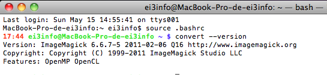

================================================================================
Installing ImageMagick
================================================================================

GNU/Linux
--------------------------------------------------------------------------------

On Debian and Ubuntu, a simple ::

    #> aptitude install imagemagick

Mac OS X
--------------------------------------------------------------------------------
All instructions for installation are on ImageMagick website. [[Howto for
ImageMagick
installation|http://imagemagick.org/script/binary-releases.php#macosx]]

Once ImageMagick has been added to your PATH, you can test it has been
correctly installed, by doing:::

    $> convert --version

   Test for ImageMagick Installation

You may have to install GhostScript and FootMatic in addition to ImageMagick.
You can download binaries for Mac OS X here :
http://www.linuxfoundation.org/collaborate/workgroups/openprinting/macosx/foomatic

Microsoft Windows
--------------------------------------------------------------------------------

.. TODO: Add ImageMagick installation on Windows
