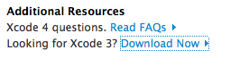

================================================================================
MarkUS development on Mac OS X - Snow Leopard
================================================================================

*Tutorial updated in May 2011, on Snow Leopard, version 10.6.7*

**Please note the difference between $> and #>. The $ means execute the command
as simple user, the # means execute the command as the super-user or use sudo
as normal user (#> is equivalent to $> sudo)**

Setting up Git
================================================================================

Git is the Source Content Management used by MarkUs. You can find some
documentation on GitHub. You will also have to set-up a GitHub account. [[How
to set-up Git on Mac Os X|http://help.github.com/mac-set-up-git]]

Download the source code
--------------------------------------------------------------------------------
Once everything is set up and you have forked MarkUs, clone your repo:

::

  git clone <your_repo>

   Git clone your repo

Setting up the Database
================================================================================

**Note : You can either use PostgreSQL or MySQL or SQLite3 as database**

SQLite3 is easier to install, but should only used in development, not in
production. You may also experience database conflicts, in particular if you
want to test **PDF Conversion**. In case of PDF Conversion, you **MUST** use
PostgreSQL or MySQL

Once you have decided what database best suits you :

* [[Setting up the Database (SQLite)|SettingUpSQLite]]
* [[Setting up the Database (MySQL)|SettingUpMySQL]]
* [[Setting up the Database (PostgreSQL)|SettingUpPostgreSQL]]

Setting up Ruby and Ruby on Rails and Subversion
================================================================================

Setting up XCode
--------------------------------------------------------------------------------

To build correctly some librairies, you need ruby headers. On Mac OS X,
ruby-headers are provided with XCode. Xcode recently became non-free, but the
former version 3 is still free and available.

Go to http://developer.apple.com/xcode/ and look at the Download XCode3 link:

   Download Xcode 3 for Mac OS X

This package is quite big (4GB). Once downloaded, open it and install it using the package provided:

   Install Xcode 3 for Mac OS X

Getting started with Xcode (optionnal)
--------------------------------------------------------------------------------

* Create a new Xcode project and then select "Window" -> "Organizer"
* Navigate to the directory containing the MarkUs source code in a Finder window
* Drag your MarkUs source code directory from the Finder window into the
  Organizer window
* That's it! 
* To run rake tasks, hold down the "Action" toolbar item and you'll be
  presented with a list of rake tasks that you can invoke

Some more information about getting started with Xcode can be found here:
[[Developing Rails Applications using Xcode |
http://developer.apple.com/Tools/developonrailsleopard.html]]

Subversion-rubybindings
--------------------------------------------------------------------------------

Install [[Subversion Bindings Binary |
http://www.open.collab.net/downloads/community/]].

   Subversion Ruby bindings for Mac OS X

Then add the following lines to config/environments/local_environment_override.rb 
from the MarkUs root directory (if this file does not exist, create it)::

    config.autoload_paths << "/opt/subversion/lib/svn-ruby"
    config.autoload_paths << "/opt/subversion/lib/svn-ruby/universal-darwin/"

Setting up Rubygems
--------------------------------------------------------------------------------
First, you will need rubygems (previously installed)

To ensure you have the good version of rubygems, please do::

    $> gem --version

   How to see rubygems version

If your version of rubygems is < 1.3.6, please update it ! To update Rubygems, please do::

    $> sudo gem update --system

  

   Updating rubygems

This section assumes, you have gem version >= 1.3.6 (required for rails version
> 2.3.7).

   How to see rubygems version

So, the list of gems required for MarkUs is as follows:

* rails
* db_populate
* i18n
* mongrel_cluster
* routing-filter
* rake
* mongrel
* fastercsv
* will_paginate
* rubyzip
* ya2yaml

specific gems for databases:

* pg
* mysql
* sqlite3-ruby, sqlite3

specific gems for tests and development:

* shoulda
* selenium-client
* machinist
* faker
* factory_data_preloader
* time-warp
* ruby-debug
* mocha

and a gem to manage them all:

* bundler

Note that ruby-postgres is unmaintained and does not compile against
postgresql-8.3+. Therefore, do **not** install it. Instead, install pg
which works just fine. 

We are now using bundler to manage all gems. Install only bundler as a gem and 
bundler will install all other Gems.

To install the **all** gems execute the following::

    #> gem install bundler
    #> PATH=$PATH:/Library/PostgreSQL/9.0/bin/:/usr/local/mysql/bin/ bundle install

Please note that bundler may ask you for your root password.

Bundle allows also some selective installation. To install only sqlite3
support, execute the following::

    #> bundle install --without postgresql mysql

To install only postgresql support support, execute the following::

    #> PATH=$PATH:/Library/PostgreSQL/9.0/bin/ bundle install --without sqlite mysql

To install only mysql support, execute the following::

    #> PATH=$PATH:/usr/local/mysql/bin/ bundle install --without postgresql sqlite

As you can see, you will have to indicate to Bundler the path where PostgreSQL
or MySQL were installed.

At the end, you will see a green message telling you everything is perfect:

   Bundler complete message

Installing ImageMagick
--------------------------------------------------------------------------------

If you need to use test and work on image and PDF annotation, you will need
ImageMagick. Otherwise, you can skip this part.

* [[Setting up ImageMagick|ImageMagick]]

If your want to test PDF conversion on MarkUs, don't forget to set to true the
`PDF_SUPPORT` variable in `config/environments/development.rb`

Getting Started with MarkUs Development
================================================================================

Create databases:::

    $> bundle exec rake db:create:all     # creates all the databases defined in config/database.yml
    $> bundle exec rake db:create         # creates the database defined in config/database.yml 

Next, you can execute some rake tasks to test your MarkUs installation.
Sometimes, the "Rake Tasks" view doesn't work in RadRails but you can run the
commands from the Terminal.

Enter the following commands: ::

    $> bundle exec rake db:schema:load
    $> bundle exec rake db:migrate

Next, you can load the initial database models for the current environment::

    $> bundle exec rake db:populate

Now, start the server using::

    $> bundle exec rails s

Another rake task that might be useful if you ever want to drop and recreate
the database from db/schema.rb::

    $> bundle exec rake db:reset

You can learn more about other rake tasks by entering::

    $> bundle exec rake -T

You should now be able to access MarkUs at http://localhost:3000 in your browser.

**Happy Coding!**

   MarkUs is now working on your computer !
