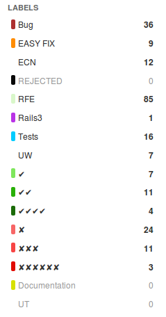

MarkUs' Issue Labels: What They Mean
================================================================================

Unfortunately, the ordering of issues (which should represent priorities on
Github) doesn't quite work. That's why a new set of labels has been added to
suit our needs. Their meaning is as follows:

 * RFE: Request for enhancement (Feature Request)
 * Bug: Self explanatory
 * ✘'s (red) are for bug prioritization (there are 6 ✘'s, 3 ✘'s and 1 ✘; the
   higher the number of ✘'s the higher the priority)
 * Checkmarks (green; ✔) are for RFE prioritization. Scheme is similar to bug
   prioritization. The more checkmarks the higher the desire to get this
   implemented.
 * ECN: École Centrale de Nantes. Can be used to filter for ECN specific
   things.
 * UW: University of Waterloo. Can be used to mark UW specific things.
 * UT: University of Toronto. Same thing.
 * REJECTED: Rejected issues.
 * EASY FIX: Ideal for beginners. Should be tricky to fix it!
 * Rails3: Particular things remaining to complete the Rails3 migration.
 * Documentation: Request for documentation

   Labels colors on GitHub.

Moreover, we now use milestones to see which bugs need to be corrected as soon
as possible. See
[[Milestones|https://github.com/MarkUsProject/Markus/issues/milestones]].
