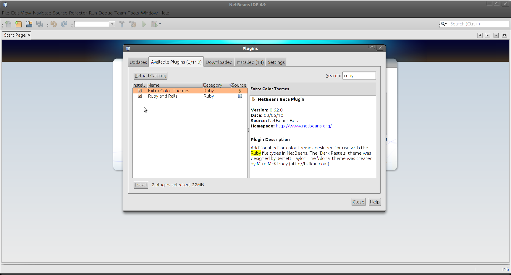
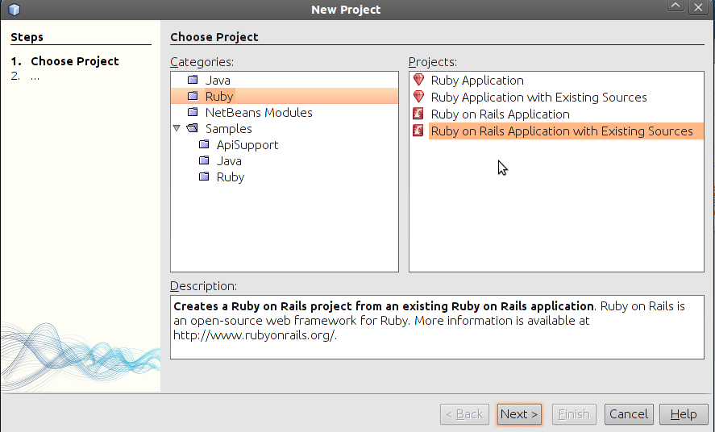
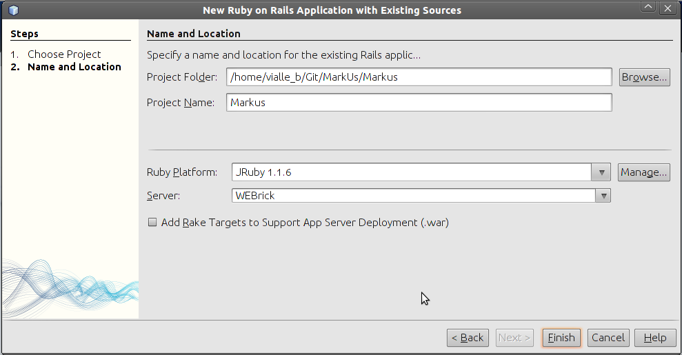
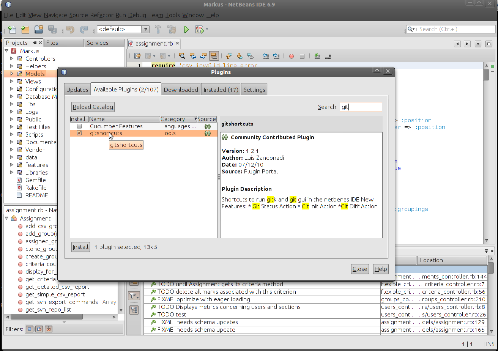

================================================================================
Using NetBeans with Rails
================================================================================

Installation
================================================================================

Netbeans can be downloaded here : http://netbeans.org/

Please check if you distribution embed Netbeans packages.

Debian/Ubuntu
--------------------------------------------------------------------------------

On Debian/Ubuntu, a simple ::

  $ apt-get install netbeans

will install netbeans.

Gentoo
--------------------------------------------------------------------------------

On Gentoo, use emerge ::

  $ emerge netbeans

Configuration
================================================================================

To use NetBeans with Rails, install the the Ruby and Rails plugin (from
Tools>Plugins).

   Please first install Ruby on Rails plugins for Netbeans

In order to use it with MarkUs, choose to create a new Ruby on Rails
Application from existing sources

It **was** not recommended to create a NetBeans project out of the existing
MarkUs source.  We used it only to edit individual files with. NetBeans used to
change the configuration files you have carefully set up already, causing many
things to stop working.  If this happens, look in particular inside
config/database.yml and restore any settings that NetBeans has changed.

   New project with existing sources

   You can use a différent Ruby Plateform if you wish to

Moreover, Netbeans can embed a Git plugin, to help you with source management.

   Netbeans and Git

**BE CAREFUL** : A graphical user interface for Git doesn't mean you don't have
to understand what you do. If you don't use Git properly, you can lose data !
