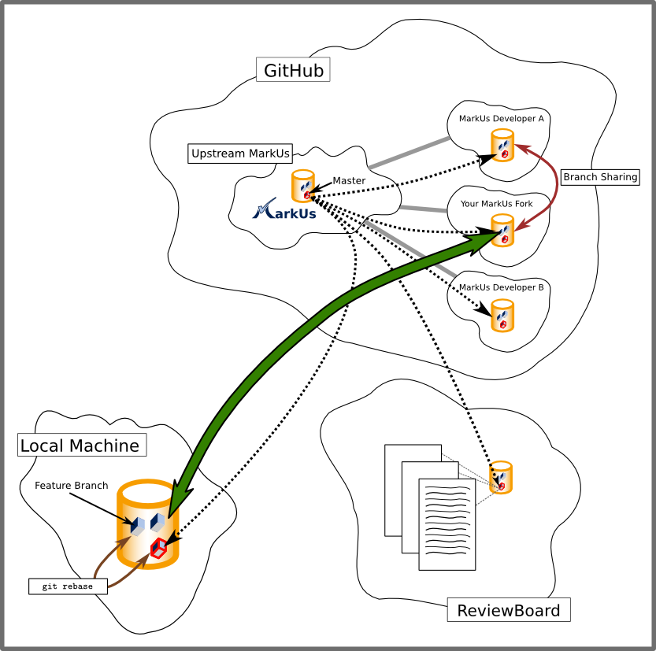

# MarkUs, Git and GitHub: How it Works

## Installation

First, you'll need to [install Git](https://git-scm.com/downloads) onto your computer.
If you already have Git installed, we recommend [updating to the latest version](https://confluence.atlassian.com/bitbucketserver/installing-and-upgrading-git-776640906.html).

**Important**: if you are developing MarkUs on Windows, you should be using WSL to manage your repository, which means you'll need to [Install Git on WSL](https://docs.microsoft.com/en-us/windows/wsl/tutorials/wsl-git) instead of on Windows directly.
All of the commands on this page should be run in the WSL 2 terminal (e.g., Ubuntu 20.04), not the regular Windows terminal (cmd.exe).

## Overview

Note that the following few paragraphs might be a bit confusing. Hang in there, there are always people around you can ask.

### Setting up MarkUs

1.  Open a GitHub account and set up an [SSH public key for Git](https://help.github.com/articles/generating-ssh-keys)
2.  Set up your Git configuration settings.

        $ git config --global user.name "First-name Last-name"
        $ git config --global user.email "your-email@example.com"

    You may omit the `--global` switch if you wish. Make sure to read up on the differences between global and non-global git configuration, though. Thanks.
3.  Ask an Admin to add you as a MarkUs developer.

4.  Visit the [MarkUs GitHub repository](https://github.com/MarkUsProject/Markus) and press “Fork”. This will create a clone of the repository for your GitHub account.

5.  From your fork, copy the URL that allows you to access it using SSH. In the terminal, navigate to your intended local development directory, and run the following command using the URL you just copied.

        $ git clone git@github.com:YOUR_GIT_USERNAME/Markus.git

    This will create a new local "Markus" folder with a copy of your repository.

6.  Next, create a "remote" to the master repository of MarkUs upstream. This will be used to keep your local copy up to date.

        $ git remote add upstream git://github.com/MarkUsProject/Markus.git

    Note the remote origin should point to the SSH URL you cloned with. If this URL contains “https”, then you have not cloned using SSH. Run the following command to change it to the URL used when cloning.

        $ git remote set-url origin git@github.com:YOUR_GIT_USERNAME/Markus.git

7.  Make sure the remote was added. The following command should output "upstream" and "origin".

        $ git remote -v

### MarkUs Development Workflow

The steps involved until your code ends up in the main MarkUs repository are the following:

1.  Create and switch to a feature branch based on up to date local master branch

        $ git branch issue-1234
        $ git checkout issue-1234

2.  Modify the files with the changes you want to implement. To check which files you've modified, as well as view your changes, use:

        $ git status
        $ git diff

3.  Commit your changes (small commits are beautiful) on your feature branch

        $ git add path/to/file.rb
        # Or "git add ."
        $ git commit -m "Fix for issue 1234: Implemented x behaviour in file.rb"

4.  Repeat Steps 2 & 3 until you are satisfied with your work and want to contribute to the main MarkUs repository.

5.  Before setting up a review request, make sure your issue and master branches are up to date (see section below), making sure the change-sets you just pulled in do not affect your code.

6.  Ready to submit? Push your branch to your personal MarkUs fork:

        $ git push origin issue-1234

7.  Go to your GitHub fork and change to your issue branch. You should see the button "Pull Request". Fill in the issue number, quick summary of the issue, description of the fix, and what testing was performed.

8.  Click "Create Pull Request" and wait for feedback!

### The Three MarkUs Git Repositories

In the above picture you can see 3 main Git repositories you will interact with. The most important ones are your forked MarkUs repository (this is most likely the only MarkUs Git repository on GitHub you have read+write access to) and the clone of this repository on your local machine. If you do branch sharing with another team member that's a slightly different story and beyond the point of giving a brief overview.

### Your Fork of the MarkUs Git Repository

You, as a developer, will be mainly working on the locally cloned MarkUs Git repository (of your fork). Add to that quite frequent pushes to your fork on GitHub, so that other developers can test your code easily (due to a current review board limitation). In order to create a pull request you'd also want to push your feature branch onto GitHub. This interaction is represented in the above picture by the large green arrow.

### Keeping Your Local Code Up-To-Date

Also note the dashed arrow coming from the main ("upstream") MarkUs Git repository and pointing to your local clone of your personal MarkUs Github fork. This arrow represents interaction you have to do to keep up-to-date with the authoritative MarkUs repository, which is constantly being updated by other developers on the MarkUs team. (More on how you can do this later.)

This subsection describes the steps you need to take to make sure your local repository is up-to-date. Generally, your `master` branch should mirror the contents of `upstream/master`, the master branch of the main MarkUs repository. Remember that **you should be doing all development on local feature branches, NOT your local master branch**! This makes merging as painless as possible.

If this sounds too confusing for you, don't worry, we are here to help.

1.  Make sure you have already set up your "upstream" remote. (See Steps 5 and 6 of "Setting up MarkUs" above.)

2.  Switch to your local `master` branch.

        $ git checkout master

3.  Update the current local branch with the `master` branch of the `upstream` repository.

        $ git pull upstream master

    Note: if you've followed our advice and done your development only on feature branches, this step shouldn't produce any merge errors!

4.  If you're currently working on a feature branch, switch back to that branch and merge the new changes in. This step might require some manual merging.

        $ git checkout issue-1234
        $ git merge master

Rather than running `git merge master`, you may want to *rebase* to HEAD of `upstream/master` instead, by running the following:

    $ git rebase upstream/master

If this doesn't mean anything to you, you may want to ask for help first. Seriously, ask for help! There's always somebody around to clarify things. :)

### Next Steps

The next step should be to continue reading this document and post questions you may have on IRC or the markus-dev mailing list.

Git Tricks
----------

### Useful Commands

-   View what changes you have made on branch `issue-1234`.

        $ git diff --full-index master issue-1234

-   Temporarily put your changes aside to have a cleanly tracked branch.

        $ git stash

-   Bring these changes back (even onto another branch, as long as it is within the same repository)

        $ git stash pop

-   Remove all changes made to a specific file.

        $ git checkout <filename>

-   Revert all changes made to the current branch. **WARNING: All changes will be lost.**

        $ git reset --hard HEAD

-   Once your branch `issue-1234` has been integrated into `master`, you might want to delete it.

        $ git branch -d issue-1234

-   You might want to see who modified a line last, and what other changes they brought in with that commit.

        $ git blame config/routes.rb

    You can also use the GitHub interface for this by clicking "Blame" when viewing a file, which will take you to a page like [this](https://github.com/MarkUsProject/Markus/blame/master/config/routes.rb).

### Issues & Solutions

**I forgot to create an issue branch and instead made changes to my master branch. I have not committed anything yet.**

-   Create and move to a new issue branch and then commit. You don't lose your uncommited changes when moving to another branch.

<!-- -->

    git branch issue-1234
      git checkout issue-1234

**I made x number of commits to my master branch and forgot to create an issue branch.**

-   Let's say you want `master` to go back to state C, and move D and E to the new branch. Here's what it looks like at first:

        A-B-C-D-E (HEAD)
                ↑
              master

    After creating a new branch using `git branch issue-1234`:

        issue-1234
            ↓

    > A-B-C-D-E (HEAD)
    >   ~ ↑
    >
    > > master

    Note that the current branch is still `master`. We now move this branch back by 2 commits using `git reset --hard HEAD~2`. You *will* lose uncommitted work here!

        issue-1234
            ↓

    > A-B-C-D-E (HEAD)
    >   ~ ↑
    >
    > > master

    Finally, switch over to the new branch and get to work: `git checkout issue-1234`.
