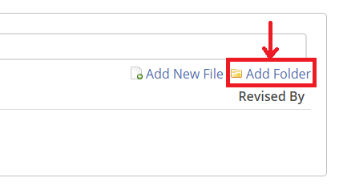

## Table of Contents:

- [Using the File Manager](#using-the-file-manager)


## Using the File Manager

The file manager allows you to upload a file or folder, download all files and folders (as a zip file) and to delete individual files and folders. Note that the "Delete" option is only visible if you have selected a file or folder on the table.


To add a file, click on the "Add New File" link located on the right side of the page:


This will display the "Upload" modal where you will be able to browse for files to upload:


If the "unzip all zip files in place" checkbox is selected, all files with the extension `.zip` will be unzipped after they are uploaded. This is useful if you want to upload a nested folder structure without having to create each subfolder one at a time.

For example, if you want to upload a bunch of files in the following configuration:

```
dir1
└── dir2
    ├── file.png
    └── file.hs
```

You're probably better off zipping `dir1` and uploading the zipfile with the "unzip all zip files in place" checkbox selected.

You also have the option to add folders one at a time. To do so, click on the "Add Folder" hyperlink on the right side of the page:  

This will create a new folder in the "Test Files" table which you will be able to name:


Make sure you press Enter after naming your folder to save it. You may not move files that have already been uploaded into the folder however you may upload files into the folder by clicking on the folder name and selecting the "Add New File" button. Once a folder has been selected, the normal file icon will change to a folder with a page sticking out. Simply click again on the folder name to deselect it.

When a file has been added to a folder it will not be visible unless you have the folder open. To open a folder, simply click on its name and you will be able to see all the files it contains:


In the above example, the .png files are contained within "New_Folder_1" as can be seen by their indent. If we close the folder by clicking on its name, the table looks like this:


Once you have added your files the data that may be displayed on the table (Note that the columns shown may vary slightly depending on the view):

 - **Filename** - The name of the file that has been uploaded. You may click on the file name to download a copy of the file.
 - **Submitted At** - The time at which the file was last uploaded
 - **Revised By** - The person who last modified the file. Only admins (instructors) may add or delete test files. Graders and students may not.

You may search through all the uploaded files using the "Filter Files" search bar. The search will match all text in the file title (i.e. you can search for the file name or the file extension).

If you wish to delete a file or a folder, select the file/folder you wish to delete and click on the "Delete" hyperlink on the right side of the page:


You will be asked to confirm your deletion:

Clicking on the "Confirm Deletion" button will remove the selected file/folder.
