# Automated Testing

## Table of Contents:
 - [How it works](#how-it-works)
 - [Initial Setup](#initial-setup)
   - [Test Files](#test-files)
 - [Testers](#testers)
   - [Initial Set-Up](#initial-set-up)
   - [Test Groups](#test-groups)
   - [Shared Fields](#shared-fields)
   - [Tester Types](#tester-types)
     - [Python](#python)
     - [Java](#java)
     - [Racket](#racket)
     - [PyTa](#pyta)
     - [Haskell](#haskell)
     - [Jupyter](#jupyter)
     - [Custom](#custom)
 - [Student-Run Tests](#student-run-tests)
 - [Running Tests](#running-tests)
   - [Submissions Table Run](#submissions-table-run)
   - [Test Results Tab](#test-results-tab)
   - [Criterion Auto-Complete](#criterion-auto-complete)
 - [Test Runs Status](#test-runs-status)

## How it works

MarkUs automatically tests student submissions using test files uploaded by an instructor by sending botht the test files and the student's submission to an automated testing server, running the test files against the student's submission and reporting the results back to MarkUs.

Tests are run by placing [files uploaded by the instructor](#test-files) and files submitted by the student in the same directory and running each test file specified by the instructor.

For example, if the instructor uploads the following files:

```
.
├── test-file.py
├── test-file2.py
└── fixtures/
    ├── data.json
    └── data.yml
```

and the student submits:

```
.
├── submission.py
├── submission2.py
└── data/
    └── data.csv
```

The tests will be run with the following file structure in place:

```
.
├── submission.py
├── submission2.py
├── test-file.py
├── test-file2.py
├── data/
│   └── data.csv
└── fixtures/
    ├── data.json
    └── data.yml
```

> :spiral_notepad: **Note:** instructor files are copied after student files so if two files have the same name, the file uploaded by the instructor will ovewrite the one uploaded by the student.


## Initial Setup
MarkUs's automated testing feature allows student submissions to be tested against code uploaded by the instructor. To set-up automated testing for an assignment, navigate to the "Automated Testing" tab of MarkUs (Assignments -> Settings -> Automated Testing):
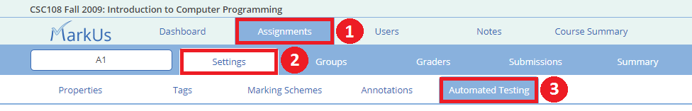

In order for the auto-testing feature to be enabled for the assignment, you must first check the "Enable tests for this assignment" checkbox at the top of the page:
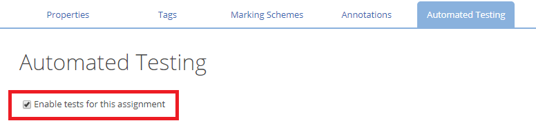

> :spiral_notepad: **NOTE:** If the "Enable tests for this assignment" check-box does not show up or is unclickable, contact your system administrator and they may enable the feature for you.

## Test Files
In the Test Files section, upload all the test scripts for the assignment (unittest files, pytest files, junit files, etc.). You may also upload any other helper files required to run the tests (fixtures, schema definitions, etc.).

See the [Using the File Manager](./General-Usage#using-the-file-manager) section for instructions on uploading and downloading files.


## Testers

Specify which tester language to use by clicking on the drop down menu located to the right of the "*Tester Type*" text and selecting one of the testing languages supported by the MarkUs autotester:

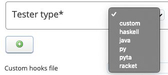

If the assignment requires **multiple languages** and you wish to run tests in all of them, you will need a new tester for each new language. To add a new tester click the green + icon at the bottom of the Testers section. You may delete an existing tester using the red x at the top right of the Tester section.

### Test Groups

Tests are organized into groups which in turn can be associated with [Criteria](./Instructor-Guide--Assignments--Marking--Marking-Schemes). Each test group can be associated with exactly one criteria and the results from the test will [automatically fill in the results](#criterion-auto-complete) when the tests finish.


Click on the green plus button under the "*Test Groups*" section of your specific tester type to create a new group:
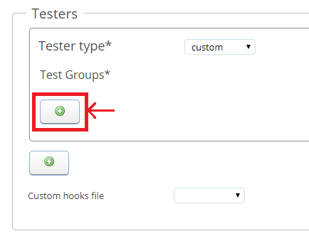

Each test group contains several configuration options that may vary depending on the type of tester you are using. The following sections explain each of these options some of which are [common to all testers](#shared-fields) and other which are [specific to the type of tester](#tester-types) being used.

#### Shared Fields
This section lists all the fields that are common to all testers:
 - **Test group name:** The name that will be displayed in the Test Name column of the Test Results tab. This is the field you'll be able to expand in the results section to see if the tests in the group have passed or failed.

 - **Display test output to students:**: There are three options in this field:
     1. Never display test output to students
     2. Only display test output to students for [student-run tests](#student-run-tests)
     3. Always display test output to students

    This determines whether the "Output" column will be displayed to students on the [test results table](#test-results-table). This column will always be visible to admins and graders.

 - **Criterion:** Select a [criterion](./Instructor-Guide--Assignments--Marking--Marking-Schemes) here that has been created and to link it to this test group. This is optional.

 - **Test Files:** Select one or more test files to run in this test group. Multiple files can be selected by holding down the "Ctrl" button and clicking several files.
 > :spiral_notepad: **NOTE:** ALL the tests specified in a file will be run. If you wish to have tests in a separate group, you must put them in a separate file. <br/>
 > :arrow_forward: **EXAMPLE:** For a python tester, select one or more unittest or pytest files; for a java tester, select one or more Junit files. Do NOT select fixtures or data files if they do not contain tests themselves.

 - **Category:** Select the type of user you wish to be allowed to run this test group. If you wish for both students and yourself (admin) to be able to run tests in this group, hold down the "Ctrl" button and click on both the "admin" and "student" lines.
 > :spiral_notepad: **NOTE:** At this time, tests are not allowed to be run by grader accounts. Graders may see test results while they are marking however they cannot initiate tests.

 - **Timeout:*** The amount of time (in seconds) before the tester will time out and halt all tests in this test group.
 > :warning: **WARNING:** If a test hits the timeout limit, a timeout error will be reported for all tests in this group.

 - **Feedback File:** The name of an output file to write feedback to. Avoid naming this the same thing as a test file or a submitted file in order to prevent the tester from overwriting an existing file. If a feedback file is specified you will be given two more options:
      - "Add feedback file to repo:" This file will be uploaded to the student's repository at the end of the tests.
      - "Upload feedback file for grading:" Uploads the feedback file to the student's submission for that assignment. The student, admin and grader will be able to view and download the file from the [grading view](./Instructor-Guide--Assignments--Marking--Grading-View).


### Tester Types
#### Python
 - **Python version**: When you select a Python tester, you will be asked to specify a Python version. MarkUs currently supports Python versions 3.6+.

 - **Package requirements:** In this section you may specify additional PyPi(https://pypi.org/) packages required by your tests. The regular `pip install` syntax is supported. Use a space to separate different packages.
  > :arrow_forward: **EXAMPLE:** `hypothesis>=5.29 pandas==1.0.0 pygame`

 - **Test runner:*** Allows you to select your unit testing framework (MarkUs currently supports pytest or unittest).

 - **Output verbosity:** Allows you to select how much information is displayed in the "Output" column of the test results section. Different verbosities will be able to be selected depending on the specified test runner. Please see the appropriate framework documentation for more information on output verbosity ([pytest](https://docs.pytest.org/en/stable/usage.html#modifying-python-traceback-printing), [unittest](https://docs.python.org/3/library/unittest.html))

#### Java
 - **Java Class Path**: `:` delimited list of paths to include in the java class path when compiling java files tests. Each path should be a relative path from the root of the test directory. Whatever string is written here will be be passed to the `javac` and `java` commands as the value of the `--classpath` flag when compiling and running tests.

 - **Java Sources (glob)**: relative path or glob from the root of the test directory indicating the location of `.java` files to compile when running tests. For example, if you upload two files: `Test.java` and `subdir/Helper.java` where `Test.java` depends on `subdir/Helper.java` but tests only exist in `Test.java`, make sure that `subdir/Helper.java` is included in the java sources or else a classfile will not get created for the `Helper` dependency.


#### Racket
In Racket, each test file must be added separately with the appropriate test suite name specified underneath:
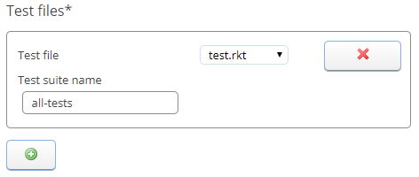

#### PyTa
 - **Python version**: When you select a PyTA tester, you will be asked to specify a Python version. MarkUs currently supports Python 3.6+.

 - **Package requirements:** In this section you must specify the appropriate PIP package (see the same section for the [Python](#python) tester.)

 - **Path:** Specify the filename of the file submitted byt the student you wish to check with PyTA. Because of this it is advised that you create [required file names](./Instructor-Guide--Assignments--Setting-Up#required-files) for this assignment. Add another file by clicking the green + under this section.

 - **Maximum mark:** This section will determine the mark associated with the PyTA test. Whatever number you enter here will be the mark a student receives for a perfect test. Every error detected by PyTA will reduce the student's mark by 1 down to a minumum of 0.

 - **PyTA configuration:** Select an uploaded file that contains configuration options for PyTA. This should be a json file that, when loaded as a python dictionary, can be passed to the `config` keyword argument for the [`check_all`](https://github.com/pyta-uoft/pyta/blob/45504df2f448754c4db4bdc38de65e0ced7cb791/python_ta/__init__.py#L52) function. This dictionary can contain any of the [Pylint option and switches](http://pylint.pycqa.org/en/latest/technical_reference/features.html) and any of the [PyTA specific configuration options](https://github.com/pyta-uoft/pyta/blob/master/python_ta/.pylintrc). <br/>
 For example, a config file that tells PyTA to ignore some pylint checks and to allow some additional import statements might look like:

	```json
	{
	  "extra-imports": [
	    "typing",
	    "random"
	  ],
	  "disable": ["E9997", "E9959", "C0412"]
	}
	```

 - **Upload annotations:** If this checkbox is selected, any errors and warnings discovered by PyTA will be added as annotations to the submitted files. Selecting this box also requires the "Annotation file" field to be filled in. The "Annotation file" field should contain a file name that does not conflict with any of the uploaded test files or student files.

#### Haskell
 - **Per-test timeout:** This section allows you to specify how much time (in seconds) the checker should spend on each individual test before it times out.

 - **Number of test cases (Quick Check):** This section allows you to modify the number of test cases that will be run by Haskell's quick check testing framework per test.

#### Jupyter

 - **Python version**: When you select a Jupyter tester, you will be asked to specify a Python version. MarkUs currently supports Python versions 3.6+.

 - **Package requirements:** In this section you may specify additional [PyPi](https://pypi.org/) packages required by your tests. The regular `pip install` syntax is supported. Use a space to separate different packages.
   > :arrow_forward: **EXAMPLE:** `hypothesis>=5.29 pandas==1.0.0 pygame`

 - **Test files**: The Jupyter tester works by taking two notebook files and merging their cells before running the merged notebook and executing the tests described in the merged file. Select one of your uploaded test files in the "Test file" dropdown and fill in the "Student file" input with the name of the file that students will submit that should be merged with the "Test file". Both files should be jupyter notebook files with a ".ipynb" extension.

   Files are merged by finding cells in the "Test file" and replacing them with cells that _have the same id_ in the "Student file". For more details, see the `merge` function from the `notebook_helper` package [here](https://github.com/MarkUsProject/autotest-helpers/tree/main/notebook_helper#merger).

   > :warning: **WARNING:** [Cell ids](https://nbformat.readthedocs.io/en/latest/format_description.html#cell-ids) are only fully supported in jupyter notebooks from nbformat version 4.5. If your notebooks have a "nbformat" value <4 or a "nbformat" value of 4 and a "nbformat_minor" value of < 5, this tester will fail.

   In order to ensure that the cell ids in the student submission file match those of the test file we recommend distributing files and writing tests in the following manner:

   1. Create a jupyter notebook to distribute to the students as a starter file. Make it clear where each question starts and stops and provide pre-existing cells to fill answers in if possible.
   2. Before distributing the file to the students, make the cells in the starter file non-deletable by setting the "deletable" value in the cell's metadata to false (https://nbformat.readthedocs.io/en/latest/format_description.html#cell-metadata). This will discourage students from deleting these cells. You can also choose to make certain cells not editable by changing the "editable" value instead.
   3. Distribute the notebook to your students.
   4. Take a copy of the same notebook you distributed and add new test cells to this notebook. The notebook will be executed in order so test cells for a given question should be added below the cells that students will fill in for that same question.

   To indicate that a cell is a test cell, the first line of the cell should be a comment where the first word of the comment is "test". The rest of the comment can be a description of the test or be blank. The rest of the cell should contain test code. A test will fail if an error is raised, and will pass if no error is raised (the same rules when writing test functions for [pytest](https://docs.pytest.org/) tests. For example, the following cell is a test that will fail:

   ```py
   # test that 1 equals 2
   assert 1 == 2
   ```

   You can choose to run an additional test by selecting the "Test that files can be merged" checkbox. This will validate that the "Test file" and "Student file" that you have selected can be successfully merged using the [`check`](https://github.com/MarkUsProject/autotest-helpers/tree/main/notebook_helper#merger) function. If the two files can be successfully merged, the autotester reports a successful test, otherwise it reports a failed test. If the "Test that files can be merged" checkbox is not selected, this test will not be run. Either way, the autotester will _try_ to merge the files and report the results.


   > 🗒️ **NOTE**: If you wish to write more complex test with jupyter notebooks than can be supported by merging notebooks we recommend using the Python tester to write unit tests. In order to import jupyter notebooks as python modules use the [notebook_helper](https://github.com/MarkUsProject/autotest-helpers/tree/main/notebook_helper) package.


#### Custom
No special fields are required for this tester type. The custom tester works by simply running an executable script (uploaded by the instructor) and reporting the results back to MarkUs. This script must report the results in a specific format [outlined here](https://github.com/MarkUsProject/markus-autotesting#the-custom-tester).

## Student-Run Tests
Students may also run test themselves using the autotester. To enable this, select the "Allow students to run tests" checkbox:
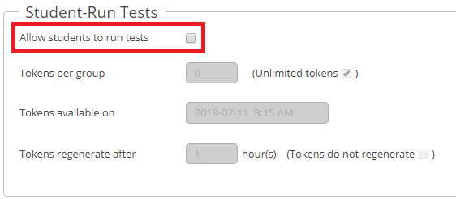

To avoid overloading the testing system during periods of high demand, student access to the testing system is controlled using **test tokens**.

You may customize this feature using the following settings:

 - **Tokens per group** This will allow you to set a limit on the number of times each group may run the test suite. If you wish for there to be no limit click the "Unlimited tokens" checkbox. Running one test costs one token.
 > :spiral_notepad: **NOTE:** If students are working in a group then they all share one token pool. For example, if student A and student B are in a group and they are given 8 tokens, they can only run 8 tests total (i.e. if student A tests their submission 6 times, student B can only test the submission 2 more times).

 - **Tokens available on**  This allows you to set the date and time of when you would like the students to begin testing. If you wish for the students to begin testing immediately simply set this field to the current date and time.
 > :spiral_notepad: **NOTE:** Students will be allowed to start tests up until the assignment deadline INCLUDING all extensions.

 - **Tokens regenerate after** This allows you to set the time it takes for tokens to regenerate. Once a token has been used, it will be unavailable until X hours have passed, at which point the students may use that token to perform another test. If you wish for tokens not to regenerate, select the "Tokens do not regenerate" checkbox.
 > :warning: **WARNING** Because of limited server space, it is recommended that instructors configure assignments so that each group has 8 tokens taking 24h to regenerate. If too many groups try testing their submissions at the same time (especially if there are many tests) then it may take a very long time.

# Running Tests

## Submissions Table Run
Once the automated testing feature has been enabled, a new clickable box (Run Tests) will appear on the Submissions page.
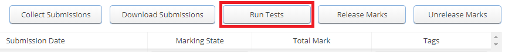

**After the submissions have been collected**, select one or more rows from this table and click the "Run Tests" button. Doing so will commence the testing process for the selected submissions. You can check the status of the tests by visiting the "[Test Runs Status](#test-runs-status)" tab of MarkUs.

## Test Results Tab
To view the results of a test, you must first navigate to the "Test Results" tab of the specific assignment you wish to view. From the Submissions tab, click on the name of the group who's assignment you wish to inspect:
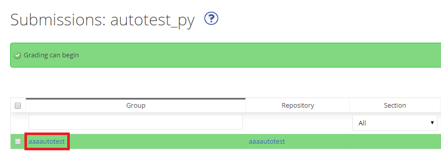

This will bring you to the grading view, where you must now click on the newly added "Test Results" tab:


#### Test Results Table
When you first arrive at the test results table you will see a list of all the tests that have been run for the submission:
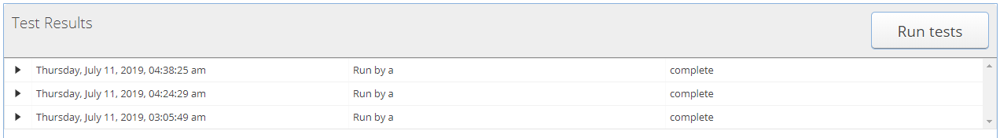

 - The **first column** is a small black triangle that allows you to expand the specific test for more information.
 - The **second column** gives the date and time of when the specific test was run.
 - The **third column** tells you who ran the test
 - The **fourth column** gives the [status](#test-runs-status-table) of the test.

Clicking the black triangle will expand the results of the given test run showing the results of all tests, grouped by [Test Group](#test-groups).
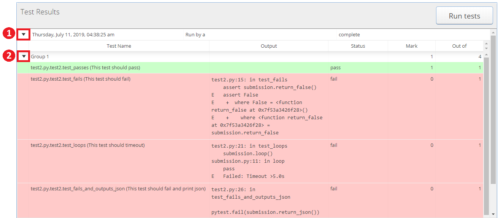

 - **Test Name** - The name of the test group will be in the white box (in the above example the grouping name is "Group 1"). Underneath this will be a list of all the tests that were run in the group. The Test Name format depends on the type of test run but typically contains a unique identifier for each test file. In the example above, the identifier includes the file name, test class, and test method as well as the content of the docstring for that test method.
 - **Output** - Any output from running the test. In this example, it contains the failure message. - see "[Testers](#testers)" for more information.
 - **Status** - One of:
    - pass : the test passed with full marks
    - partial : the test passed with partial marks (between zero and the maximum)
    - fail : the test failed (and returned 0 marks)
    - error : the test failed because of an unexpected error
 - **Mark** The mark given after running the test
 - **Out of** The maximum possible mark for each test

## Criterion Auto-Complete
If a criterion for a test grouping is specified in the "[Testers](#testers)" section, the result will appear in the "[Marks](./Instructor-Guide--Assignments--Marking--Grading-View#marks)" tab of the grading view.

For example, in the following image the submission has passed 1 out of 3 of the "Group 2" tests:
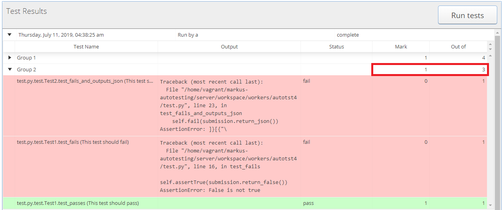

Since the "Group 2" testing group was associated with a criterion with a mark out of 6, MarkUs converts the 1/3 tests passed to a mark out of 6 and prints the result in the "Marks" section:
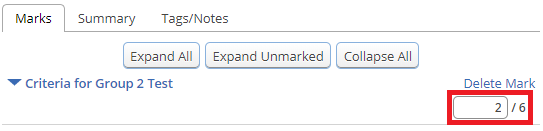
MarkUs will convert all results with a precision of 2 decimal places (ex. 2/9 will be represented as 1.33/6 if the criterion requires a mark out of 6).

# Test Runs Status

The "Test Runs Status" page gives the instructor an overview of all the tests that have been run or are currently running for an assignment. To get to the "Test Runs Status" page, click on the "Assignments" tab of MarkUs, then on your specific assignment and then finally on the "Test Runs Status" tab:
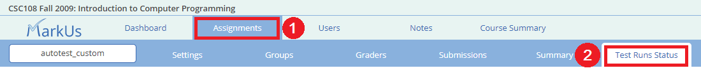

> :spiral_notepad: **NOTE:** In order for the "Test Runs Status" tab to be visible, the "Enable tests for this assignment" check box must have been checked off in the "[Automated Testing](#initial-setup)" section of MarkUs for the specific assignment.

## Test Runs Status Table
The Test Runs Status Table will give you all the information you need about the tests being run for this assignment:
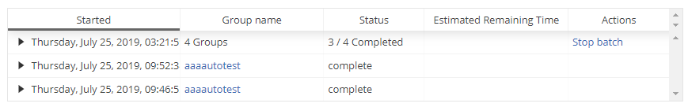

 - **Started:** This column will tell you the date and time when the test was initially started.
 - **Group name:** This column will tell you the name of the group whose test was run. If a batch of tests was run, it will tell you how many groups in the batch. When the batch is expanded it will show the individual group names.
 - **Status:** There are 5 different statuses that may appear in this column:
     - complete: this means the test has been competed without any issue (note: the submissions may not have passed all the tests but all the tests have been run without errors).
     - in progress: this means that the test is still being run. Refresh the page in a little bit and it may have finished.
     - X/Y Completed this means that X tests in the batch of Y tests have been completed (analogous to in progress for a single test if X < Y and analogous to completed for a single test if X = Y).
     - problems this means that there were unexpected errors reported while running this test.
 - **Estimated Remaining Time:** This column will tell you how much time is estimated for the remaining test(s) to take (row only).
 - **Actions** This column will allow you to either stop the batch of tests or a single test. Note that tests that have already finished running will not be affected and the results will still be displayed as normal.
