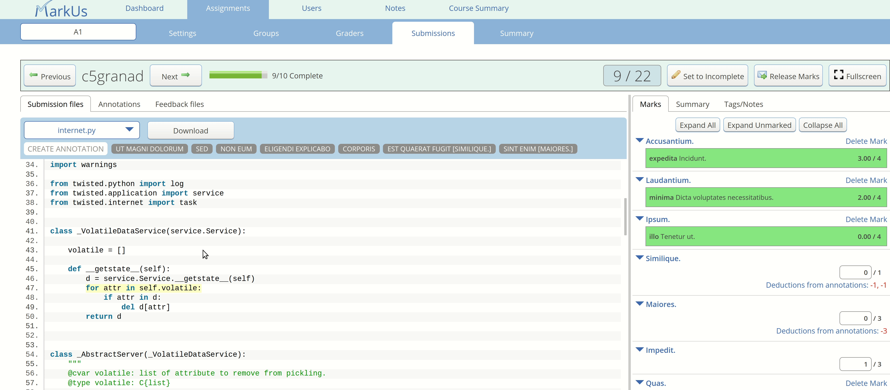

## Table of Contents:
 - [What are Deductive Annotations?](#what-are-deductive-annotations)
 - [Setting up the annotation category](#setting-up-the-annotation-category)
 - [Setting up annotations](#setting-up-annotations)
 - [Deductive annotations in the interface](#deductive-annotations-in-the-interface)
 - [Applying deductive annotations and creating on the fly annotations](#applying-deductive-annotations-and-creating-on-the-fly-annotations)
 - [Overridden deductive annotations](#overridden-deductive-annotations)

## What are Deductive Annotations?
Deductive annotations build on existing annotation functionality. They can be used to highlight parts of a submission and give specific comments. Additionally, deductive annotations have a mark deduction associated with them. When a deductive annotation is applied, the deduction is applied to the relevant mark.

## Setting up the annotation category
You must have already created a flexible criterion to which you want to associate deductions from annotations. Deductive annotations must be grouped in an annotation category (accessible from the administrator settings of an assignment).

Once at the settings page, click on an existing annotation category, or create one. Under annotation category name, there will be a drop down selector for a flexible criterion. Select the criterion you wish to deduct marks from with annotations belonging to this category, and remember to save your choice.

### Notes:
* Multiple annotation categories can be linked to the same criterion.
* Only flexible criteria can be linked to an annotation category, not rubric criteria or checkbox criteria.
* When changing an annotation category's associated criterion, the deductions for annotations in the category will be scaled according to the change in the maximum marks of the criteria.
* When first choosing a criterion for an annotation category that already has annotations, the pre-existing annotations will have their deduction values set to 0.0.
* To stop an annotation category from being associated with a flexible criterion, select the `None` option in the drop down.
:warning: **WARNING** _You will lose the deduction value for every annotation in the category, and marks that have been calculated with those deductions will no longer take into account those deducted points._
* You may **not** change the configuration for, or delete, an annotation category when deductive annotations of that category have been applied to released results. The input becomes disabled.

## Setting up annotations
Once an associated criterion has been selected, individual annotations can be configured to deduct points. In the annotation category settings pane, the list of annotations will now display a deduction value. This value can be changed by selecting a deduction value in the number field when editing the annotation. This input option also appears when creating a new annotation.

### Notes:
* Deduction values can be specified up to the second decimal point.
* Deduction values can be between 0 and the maximum mark of the criterion (inclusive).
* You can create new deductive annotations for an assignment with released marks, but you will not be able to apply those annotations to released results (as is usual with regular annotations).
* The deduction input will be disabled for annotations which have been applied to released results, and trying to edit the content of those annotations will not work (a disclaimer will appear).

## Deductive annotations in the interface
Deductive annotations appear in the marking interface similarly to regular annotations, with some differences. Annotation categories that are linked to a flexible criterion display their criterion's name in square brackets after their own name in the annotation categories panel. When the drop down is selected for those categories which have an associated criterion, each annotation option has a red deduction value to the right of it, with the exception of annotations that have a value of zero for their deduction.

Deductions from annotations are listed below the value for the mark they correspond to, with the exception of deductions that have a zero value.

Clicking on a deduction in the list under the mark value will take you to the annotation which results in that deduction.

## Applying deductive annotations and creating on the fly annotations
To apply a pre-existing deductive annotation, select an area of the submission, then choose an annotation from one of the categories with a criterion.

When creating an on-the-fly annotation, you can select to attribute the annotation to an annotation category with a criterion. This annotation will have a default deduction value of zero, which will only be changeable in the assignment's annotation settings page.

If deductive annotations have been applied to a result, they will appear in the annotations table for that result. A new column will be present, which lists the deduction value and criterion the annotation deducts from. This column is searchable by criterion or deduction value. (this column is also visible to students viewing results)

> :spiral_notepad: **NOTE:** TAs that have been assigned criteria will not be able to apply, edit, or delete deductive annotations that do not belong to their assigned criteria.

## Overridden deductive annotations
Sometimes, you may want to override the automatically calculated mark value. (perhaps because you applied a particular deductive annotation to several instances of a problem in the submission, but only want to penalize the student once). An overridden mark is a mark which would normally be calculated from applied deductive annotations, but was manually set by a user. In the mark input for the mark, you can manually input a grade as usual. When this is done, a button **`Revert to automatic deductions`** will appear above the mark. From that point on, applying deductive annotations will no longer affect the mark (even though they will still be listed).

### Notes:
* Inputting a mark before deductive annotations are applied will be treated as an overridden mark, but the usual **`Delete mark`** button will appear until deductive annotations are applied, at which point it will be replaced by the **`Revert to automatic deductions`** button.
* Overriding a mark to an empty value when deductive annotations have been applied is possible.
