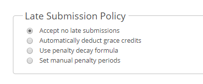
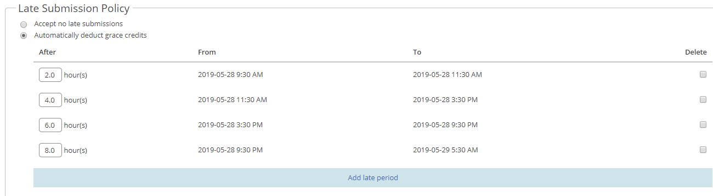
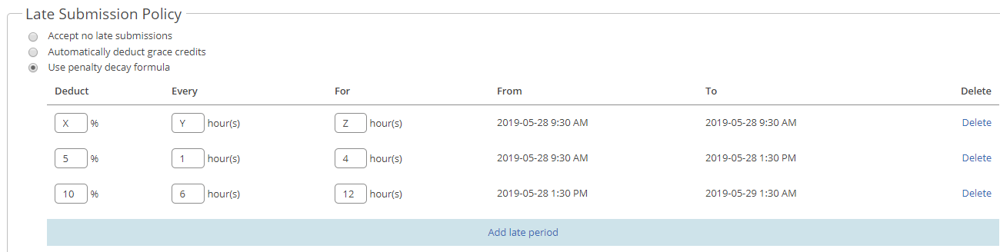
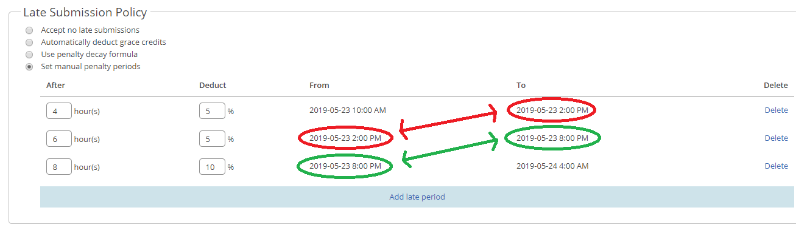

## Table of Contents

- [Accept No Late Submissions](#accept-no-late-submissions)
- [Automatically Deduct Grace Credits](#automatically-deduct-grace-credits)
- [Use Penalty Decay Formula](#use-penalty-decay-formula)
- [Set Manual Penalty Periods](#set-manual-penalty-periods)

When setting up an assignment, MarkUs allows you to choose one of 4 different methods to handle late assignments:

We'll discuss the various options below.

> :warning: **Warning**: Students will still be able to submit work after the late policy time periods have passed. However, any work submitted after the late period ends will not be collected by MarkUs for grading.

## Accept No Late Submissions
No work submitted after the deadline will be collected for grading.

## Automatically Deduct Grace Credits
This option allows you to make use of MarkUs's built in grace credit system.
Students are given a certain number of grace credits at the start of the course (this can be done in the "Users" tab). They are allowed to use these credits to extend their assignment deadlines by X amount of hours. This X is specified for each assignment in the extra "Period" fields that display when this option is selected:

In the example pictured above, if the student submits their assignment up to 2 hours late, they will use up one of their grace credits. The next grace period is 4 hours, so if the student submits their assignment between 2 and 6 hours late, they will use up two grace credits (one for the first 2 hours and another one for the extra 4 hours after that). If a student submits their assignment even one minute late, they will use up a grace credit for that first grace credit period.

For group work, _all_ members of the group must have enough grace credits available if they wish to use them for an extension. For example, if four members of a group have 6 grace credits remaining but the fifth member only has 2, the group will only be able to use 2 grace credits.

## Use Penalty Decay Formula
This option will allow you to use a built-in function that deducts X grade percentage every Y hours for a duration of Z hours. You are able to create multiple time periods in case you want to deduct 5% every hour for the first four hours and then 10% every 6 hours for 12 more hours:

Additional time periods are added by clicking the "Add late period" button and removed by using the delete link. MarkUs will automatically adjust the real time periods for you when adding and deleting.

When grading a late submission, the penalty will be automatically applied to the group's mark, but will not decrease the mark below 0. This penalty will appear in the "Summary" tab of the grading view.

## Set Manual Penalty Periods
This option allows you to set percentage penalty amounts for specified time periods.

Additional time periods are added by clicking the "Add late period" button and removed by using the delete link. MarkUs will automatically adjust the "From" and "To" times depending on the number of hours you specify in the "After" column.

Note that for each late submission method, in order for the "From" and "To" times to be calculated, a due date must be specified in the "Properties" section. If a date is not specified then the "From" and "To" sections will be empty or read "Invalid Date"

These deductions will be applied automatically, as with the "Penalty Decay Formula" option.
