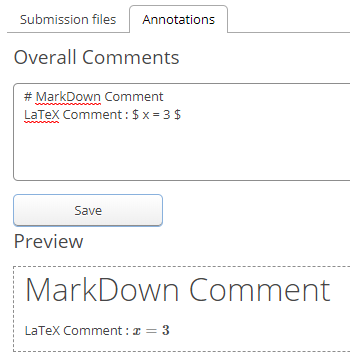

# Marking an Assignment (Grading View)

## Table of Contents
 - [Prepare to Grade](#prepare-to-grade)
 - [View Submitted Files](#view-submitted-files)
 - [Grading Bar](#grading-bar)
 - [Download](#download)
 - [Annotations](#annotations)
     - [Creating an Annotation](#create-an-annotation)
     - [Annotations Tab](#annotations-tab)
 - [Marks and Summary](#marks-and-summary)
     - [Marks](#marks)
     - [Summary](#summary)
         - [Bonuses and Deductions](#bonuses-and-deductions)
 - [Tags/Notes](#tagsnotes)
     - [Tags](#tags)
         - [Current Tags vs Available Tags](#current-tags-vs-available-tags)
     - [Notes](#notes)
 - [Automated Testing](#automated-testing)
 - [Releasing Marks](#releasing-marks)

## Prepare to Grade
Once you have [collected](Instructor-Guide--Assignments--Marking--Set-Up.md#collecting-an-assignment) an assignment you may begin grading. This is most likely the part of the process that will take the most time as it is here where you will be able to evaluate the work that the students have done. To get to the grading view, ensure you are in the "Submissions" tab of the appropriate assignment and click on the on the name of the group who's work you wish to grade (the group name will turn into a blue hyperlink once the assignment has been collected).

After doing this, you'll be taken to the grading view, where you will be able to perform a number of different actions.

## View Submitted Files
When you first enter the grading view, most of the screen will be used to display the files that a group has submit for the assignment. To switch between files click on the blue drop-down arrow beside the title of the file you're currently viewing to see a list of all the files that have been submitted:

You may display any file you wish simply by clicking on the name of the one you wish to view.

This will pull the selected file into the viewing panel where you may read and [annotate](#annotations) the file.

## Grading Bar
The grading bar, located at the top of the grading view page, provides some useful features for the grader.

The left half of the bar allows you to quickly switch between assignments by clicking on the "Previous" and "Next" buttons. It also displays the group number of the group who's submission you're currently grading. Finally, on the right, it shows you how many submissions have been set to the "Complete" status.
The right half of the bar shows you the group's current mark for the submission (this will update as you assign and delete marks from the "marks" tab). It also allows you to set the marking for the submission to complete by clicking on the "Set to Complete" button. Once this has been done you may release the marks to the students by clicking on the "Release Marks" button (see "[Releasing Grades](Instructor-Guide--Assignments--Releasing-Grades.md)"). Finally, if you wish to switch to full screen mode, click on the "Fullscreen" button at the end of the bar.

## Download
MarkUs gives you the option of downloading the files that have been submitted. To do this, click on the "Download" button.

This will open up a download modal:

From here you may:
 - download the single file.
 - download a zip file containing all files submitted.
 - select whether annotations should be included in the file downloads (annotations may not be supported for all file types).

## Annotations
MarkUs allows you to write in comments for the students to see right on the files they have submitted!

### Creating an Annotation
To create an annotation you must first select a section you wish to comment on. In text files, you may highlight the lines you wish to annotate by clicking and dragging your cursor across the specific lines:

In the above image, an annotation is about to be made for lines 25 and 26.

In non-text files, such as images, you may select a rectangle for your annotation:

In the above image, an annotation is about to be made for the letter 'e'.

Once you have selected a section, click on the "CREATE ANNOTATION" button to begin writing:

This will open the following modal:

From this window you will be able to type out a comment for the students to see. Since the annotation field supports basic LaTeX and markdown commands, a preview is available under the text field so that you may see what your annotation will look like when released. Don't worry if it isn't perfect as there is an option to edit later! An annotation category may be specified from the drop-down list under "Annotation Category". (See the [Annotations](Instructor-Guide--Assignments--Deductive-Annotations.md) page for information on creating annotation categories) Once finished, be sure to click on the "Create Annotation" button to save your annotation!

### Annotations Tab
In order to view all the annotation you (or anyone) has created for a submission, navigate to the annotations tab of the submission

Once here, you will first see a section where you may add in any overall comments you have for the assignment. Once again, LaTeX and markdown commands are supported, so there is a preview window available:

Make sure you hit the "Save" button after editing to save your overall comments!

Underneath the "Overall comments" section is a table that lists all the annotations that have been created for this submission:

The table contains the following columns:
 - **#** - Contains the annotation number of this specific annotation (counting will begin from 1 proceed upwards). If you click on the :x: it will give you the option of deleting the annotation.
 - **Filename** - Contains the name of the file that the annotation was created for. If you click on the filename, it will take you directly to the file and line number of the annotation in the "Submission Files" window.
 - **Text** - Contains the written text of the annotation. If you wish to edit the text, click on the :pencil: to open the "Update Annotation" window.
 - **Created By** - Contains the first and last names of the author of the annotation.
 - **Annotation Category** - Contains the details of the annotation category.

You may order the table by any of the categories by clicking on the column heading you wish to sort by.

## Marks and Summary
The Marks and Summary tabs are located to the right of the viewing screen and are the sections that allow you to assign numerical grades to the submission.

### Marks
The Marks tab will list all of the criteria that were created in the [Marking Scheme](Instructor-Guide--Assignments--Marking--Marking-Schemes.md):

It is here where you are able to select specific criteria to assign marks. In the above image, you can see examples of the [checkbox type](Instructor-Guide--Assignments--Marking--Marking-Schemes.md#checkbox-type) and [rubric type](Instructor-Guide--Assignments--Marking--Marking-Schemes.md#rubric-type) criteria. The marks tab has three buttons at the top which do the following:
 1. **Expand All** - This button expands all of the criteria to allow you to see descriptions and full rubrics.
 2. **Expand Unmarked** - This button does the same thing as the "Expand All" button but only expands unmarked criteria. It is advised to click this button before moving on to the next submission to see if there are any criteria that have been missed.
 3. **Collapse All** - This button collapses the criteria into their condensed versions.

If you wish to remove a mark that was given in error, select the "delete mark" link of the criterion you wish to remove. This will set the score for that criterion back to 'unknown'.

### Summary
The Summary tab gives you an overview of the criteria for the submission, allows you to add bonuses or deductions, and calculates the total mark for the assignment.

#### Bonuses and Deductions
To create a bonus or deduction, click on the "Create Bonus/Deduction" button which will open up a new row in the Bonuses/Deductions table for you to edit. You may add a description and must add a numerical value for the bonus (negative values are considered deductions).

The Summary tab will auto-calculate the total bonus and will add it on to the subtotal, giving the total mark for the submission.

## Tags/Notes
The Tags/Notes tab allows you to add a short tag or a note to the assignment you're viewing.

### Tags
To create a tag, click on the "Create Tag" button in the Tags/Notes view of the selected assignment.

Doing this will open the "Create Tag" window where you will be able to enter a name for your tag and a description. The tag description has a hard limit of 120 characters.

When you're finished click the "Save" button and your tag will appear in the "Current Tags" section of the grading view page.

#### **Current Tags vs Available Tags**
**Current Tags:** Apply only to the current submission and will be visible in the tags column of the Submissions table:

**Available Tags:** Tags that have been created but do not apply to the current submission. These will NOT be visible in the tags column for that submission.

> :spiral_notepad: **NOTE:** All tags are available to be added to any submission within an assignment. To switch a tag from "Current" to "Available" simply click on the tag and it will switch positions.

> :warning: **WARNING:** Once a tag has been created, it may not be deleted! (Tags can be set to "available" in order to make them "inactive")

### Notes
To create a note click on the small "Notes" hyperlink under the tags dialogue in the Tags/Notes tab.

This will open the note viewing window where you will be able to see the content, author and date of creation of each note. You are also able to add your own notes from this window. The number in parentheses beside the hyperlink lets you know how many notes have been created for this particular submission.

The deletion of a note can be done from the "[Notes](Instructor-Guide--Notes.md)" tab of MarkUs.

> :spiral_notepad: **NOTE:** Unlike tags, notes are unique to each submission and are only visible when the notes hyperlink is clicked.

## Automated Testing
MarkUs allows automated testing for assignments written in certain supported languages. The automated testing feature will be available on the grading view page once it has been set up. Please see the [Automated Testing](Instructor-Guide--Assignments--Automated-Testing--Set-Up.md) page for more information on how to set up this feature.

## Releasing Marks
Once you're done grading an assignment, you may release the marks to your students. To learn more about how this is done, please see the [Releasing Grades](Instructor-Guide--Assignments--Releasing-Grades.md) page.
