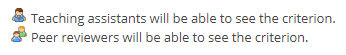

# Setting Up a Marking Scheme

## Table of Contents:
 - [Initial Setup](#initial-setup)
 - [Criterion Types](#criterion-types)
     - [Editing Window](#editing-window)
     - [Flexible Type](#flexible-type)
     - [Checkbox Type](#checkbox-type)
     - [Rubric Type](#rubric-type)
 - [Reordering Criteria and Visibility](#reordering-criteria-and-visibility)
     - [Reordering Criteria](#reordering-criteria)
     - [Visibility](#visibility)
 - [Learn More](#learn-more)

## Initial Setup
To set up a marking scheme for an assignment, navigate to the "Criteria" tab of the assignment you wish to modify:

The MarkUs software allows you to add one (or many) criterion by which you would like the assignment to be evaluated. Initially, after you've first created the assignment, there will be no criteria in the "Marking Scheme" table. To add your first criterion, simply click on the "New Criterion" link on the top right hand side of the page!

This will open up the default criterion editor and you will be asked to input the name of your criterion.
Below the name field, is the "Maximum mark" box which can be set to any value greater than 0.

> :spiral_notepad: **NOTE:**  The "Maximum mark" field will only accept fractional numbers to a precision of 1 decimal place (ex 2.4 is fine but 2.42 is not).

Finally, you must select a criterion type for your criterion. The three types that you may choose from are the are [Rubric Type](#rubric-type), the [Flexible Type](#flexible-type), or the [Checkbox Type](#checkbox-type). Each of these three types will be discussed in the following section but for now select the flexible type and click save:

Once a criterion has been created you may click on its name to open the editing window:

## Criterion Types
There are 3 different criterion types: rubric type, flexible type and checkbox type. To access the features of each type, you must first create a criterion, select a type and open up the criterion editing window (see [Initial Setup](#initial-setup)).

### Editing Window
When the criterion editing window is opened for any type, it will look similar to this example:

 - At the top you can see the name of the selected criterion. The type of the criterion is specified in parentheses (in this case the flexible type is pictured).
 - The name and maximum mark can always be changed in their respective boxes at the top of the window.

 - Below these you may see all the required files listed for the assignment.

 - A description of the criterion may be added in the "Description" box (HTML supported).

 - At least one of the two "Visibility" boxes must be selected.
     - The "Make visible to teaching assistants" box should be selected if you want the criterion to be available to your TAs for marking. Note that if you do not have any TAs or you wish to grade this assignment yourself using this criterion, this box must still be selected.
     - The "Make visible to peer reviewers" box should be selected if you want the criterion to be available to students for grading each other's assignments. For more information on peer review, please see the "[Peer Review](Instructor-Guide--Assignments--Peer-Review.md)" section of the instructor guide.

 - When you are satisfied with your criterion, click the save button to save your changes!
 - If you wish to delete a criterion, simply click the delete button at the top right hand side of the page (don't worry if you hit delete by accident as you will be prompted to confirm deletion once selected).

### Flexible Type
The flexible criterion type allows graders to manually insert a mark for that criterion. The following is an example of a flexible criterion type that a grader might see:

The title of the criterion is at the top with the description underneath. The grader may select any value to be entered into the mark box. Note that the box will turn red if the entered mark exceeds the maximum value specified however it will NOT provide any warning if a negative value is entered.

### Checkbox Type
The checkbox criterion type allows graders so select either 'Yes' or 'No' depending on if the criterion was met. The following is an example of a flexible criterion type that a grader might see:

### Rubric Type
The rubric criterion type allows graders to select a level depending on on the ones specified. When you open the criterion editing window for a rubric type, it will have all the same fields as specified in the "[Editing Window](#editing-window)" section as well as one extra one, which will allow you to edit the rubric:

The editing panel for a rubric type criterion allows you to specify the title, description, and marks for each level. Levels can be added and removed but each criterion must have at least one level.

The following is an example of a rubric criterion type that a grader might see:

Notice that MarkUs automatically fills in the numerical grade for each level once you specify a maximum grade. A rubric criterion type will allow the grader to select one and only one of the level options in the rubric.

## Reordering Criteria and Visibility

### Reordering Criteria
If you wish to reorder criteria you can do so by clicking and dragging the grey squares that appear on the left hand side of each row:

### Visibility
Once you've chosen the visibility of your criterion a small icon will be visible under the "Visibility" column of the marking scheme that represents the type you chose:

## Learn More
If you wish to learn more about how to grade an assignment (and about how your criterion changes affect what the graders can see and do) check out the [Marking an Assignment](Instructor-Guide--Assignments--Marking--Grading-View.md) page.
