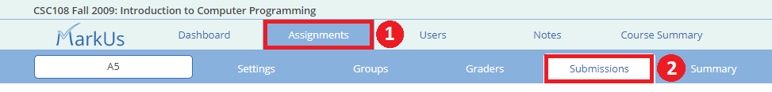
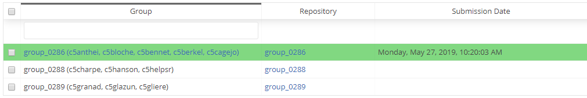
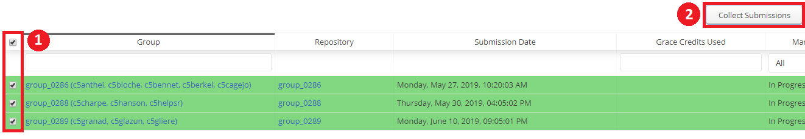

# Marking an Assignment (Set-Up)

## Table of Contents
 - [Setting Up a Grader Account](#setting-up-a-grader-account)
 - [Submissions Table](#submissions-table)
 - [Collecting an Assignment](#collecting-an-assignment)
 - [Marking State](#marking-state)
 - [Grading View](#grading-view)

> :spiral_notepad: **NOTE:** Before you will be able to perform any numerical marking (i.e. assigning groups a numerical grade) you must set up a [marking scheme](./Instructor-Guide--Assignments--Marking--Marking-Schemes) for your assignment.

## Setting up a Grader Account
If anyone other than the course instructor (admin) wants to be able to grade a student (or group's) work, they must have a "Grader" account. This means if a course has 4 TAs and everyone wants to be able to grade work, you must set up 4 separate "Grader" accounts - one for each TA. The course instructor does not require a separate account for grading as all marking can also be done from the admin account.

For information on setting up a "Grader" account please see "[Grader Accounts](./Instructor-Guide--Users#grader-accounts)".

## Submissions Table
The first step in marking an assignment is to collect the assignment. To do this, navigate to the "Assignments" tab of MarkUs, click on the assignment you wish to mark and then on the "Submissions" tab:

Here you will see a table of all the groups that have been formed (see [How Students Form Groups](./Student-Guide) and [Managing Group Repositories](./Instructor-Guide--Groups)):

|  |
|--------------:|
| *First three columns shown* |

If students are not allowed to work in groups, then under the "Group" column you will simply see a student's username (as opposed to the group number and a list of usernames). The rest of the table contains information about each group and their submission for that assignment.
 - The **"Repository"** column contains a link to the group's repository (where you can see all the files uploaded to the repo)
 - The **"Submission Date"** column provides the date and time that the collected submission was submitted. This column will be blank if the submission has not been collected yet or if a student did not submit any work for this assessment.
 - The **"Grace Credits Used"** column lists the number of grace credits a group spent on this assignment (field will be blank if no tokens were required)
 - The **"Marking State"** lists the current state of marking of the group's submission (see [Marking State](#marking-state))
 - The **"Total Mark"** column lists the group's mark once a grader has started entering marks for the assignment (default is 0).
 - The **"Tags"** column lists any tags created for the submission.

## Collecting an Assignment
Before you may being grading an assignment, you must first collect the submitted files from each group. To do this, make sure you are on the "Submissions" page of the assignment you wish to grade and select the checkbox(es) of the groups from which you wish to collect. You may also select the box at the top of the column to select all groups. Once satisfied, click on the "Collect Submissions" button to begin collection.

> :spiral_notepad: **NOTE:** MarkUs only allows you to collect submissions AFTER the entire grace credit period has passed.

When the collect command is executed it checks to see the file version for each submission that meets the due date and/or late penalty set for this assignment. It then creates the views for annotating and grading each submission.

> :warning: **WARNING: If the collect operation is carried out after grading has begun (by admin or a TA) this grading work will be overwritten.** To prevent the preceding warning from occurring, ensure that you do not re-collect after any grading work has begun.

Once the files for an assignment have been collected, the marking state of the submission will change from "Not Collected" to "In Progress".

### Overriding the Default Collection Process

An instructor can bypass the collection process to manually select which version of a group's files to collect and grade (this is helpful when an individual extension is given to a student, for example). To do so, first click on the "Repository Name" link for the appropriate group. Then navigate to the version of the submitted files you wish to grade, and click on the "Manually Collect and Grade Revision" button.

## Marking State
There are six different marking states for a submission:
 1. **Not Collected** - The group has been formed and may have submit work already but nothing has been collected by any TA or admin. All groups should have this status until the deadline to submit (with grace token extension) has passed.
 2. **In Progress** - Either a TA or an admin has collected the submission and is currently working on grading the assignment.
 3. **Complete** - The grading of the assignment has been completed but the mark has not yet been released to the group.
 4. **Released** - The mark has been released to the group along with any annotations that have been made.
 5. **Before Due Date** - The due date has not passed for this group.
 6. **Remark Requested** - This group has requested a remark request.

## Grading View
Once you have collected an assignment, you may begin grading. Please see the [Grading View](./Instructor-Guide--Assignments--Marking--Grading-View) page for instructions.
