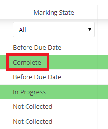
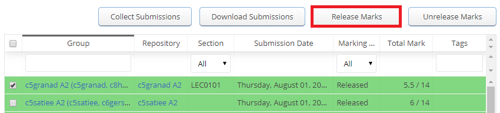
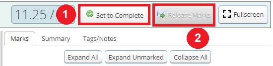
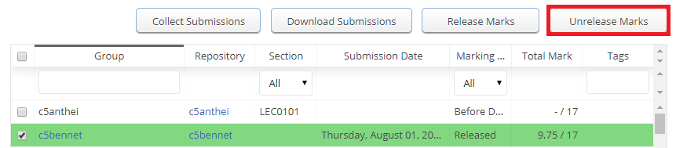
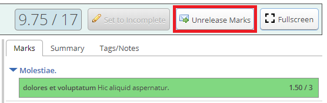

# Releasing Grades

## Table of Contents:
 - [Info](#info)
 - [Releasing Grades from Submissions Table](#releasing-grades-from-submissions-table)
 - [Releasing Grades from Grading View](#releasing-grades-from-grading-view)
 - [Unreleasing Grades](#unreleasing-grades)

> :spiral_notepad: **NOTE:** This page is about releasing grades for an **assignment**. If you wish to learn about releasing grades for a Marks Spreadsheet, please see the [Marks Spreadsheet](Instructor-Guide--Marks-Spreadsheets--Assigning-Marks.md) page.

## Info
After submissions have been [graded](Instructor-Guide--Assignments--Marking--Grading-View.md), an instructor can _Release Marks_ so that students can view their results.
Once results have been released, they cannot be changed.
However, an instructor can also _Unrelease Marks_ to modify the grading.

> :spiral_notepad: **NOTE:** Only instructors may release/unrelease results. Once TAs are done grading, they should communicate with their instructor that the grading is complete and ready to be released.

## Releasing Grades from Submissions Table
To release marks, you must first navigate to the "Submissions" tab of the assignment for which you would like to have marks released (Assignments -> Submissions):

You may only release the marks of groups who's marking state is "Complete".

For a marking state to be "Complete" you must have input a mark or selected a value for every criterion.  Once the marking is done, you must select the "Set to Complete" button in the grading view to finalize completion.

Once a marking state is set to "Complete" it is fairly easy to release the marks to your students. First, select the assignments you wish to release. You may select individual assignments by clicking on their specific specific check boxes, or select them all at once by clicking on the check box in the titles row.

Once you've selected at least one group, the "Release Marks" button should light up in the top right hand corner:

Click on the button and the marking state of selected groups should change from "Complete" to "Released". The students in that group my now view their marks, annotations, feedback files, summary, etc. for the assignment.

## Releasing Grades from Grading View
MarkUs also gives you the option of releasing grades for a specific group right from the grading view page. Again, once you have finished marking and set the group's marking status to complete, you may release their grades. The "Release Marks" button on the grading view is located to the right of the "Set to Complete" button and will only become clickable once "Set to Complete" has been clicked:

## Unreleasing Grades
Once results have been released, they cannot be changed. However, an instructor may unrelease marks if they wish to make more changes. To do this, follow the same steps as from the "[Releasing Grades](#releasing-grades-from-submissions-table)" section except select the "Unrelease Marks" button at the top of the page:  sub

> :spiral_notepad: **NOTE:** This action will work if the selected groups have the "Released" marking state ONLY. An error will be thrown if you attempt to unrelease marks that haven't been released yet and none of the selected submissions will be unreleased.

Submissions can be unreleased from the grading view page as well:

