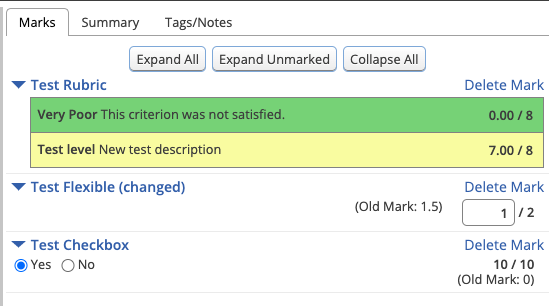

# Remark Requests

## Table of Contents:
- [Viewing Requests](#viewing-requests)
- [Responding and Remarking](#responding-and-remarking)

## Viewing Requests

If remark requests are enabled for an assignment, a student may [submit a request](Student-Guide.md) after the results have been released. Instructors may view submitted requests on the [submissions table](Instructor-Guide--Assignments--Marking--Set-Up.md#marking-state) and may respond to remark requests from the [grading view](Instructor-Guide--Assignments--Marking--Grading-View.md).

## Responding to a Remark Request

The remark request can be viewd from the "Remark Request" tab of on the Grading View page.

The request submission date as well as any notes provided by the student when making the request will be shown here.

The instructor may choose to submit overall comments on the request as well (markdown and latex markup is supported).

### Remarking

If you wish to change the marks for this student you may [update the marks as normal](Instructor-Guide--Assignments--Marking--Grading-View.md#marks) on the "Marks" tab.  Once the marks have been updated, click the "Set to Complete" and "Release Marks" buttons as normal to release the updated marks back to the student.

Both the previous and updated marks should be visible:

