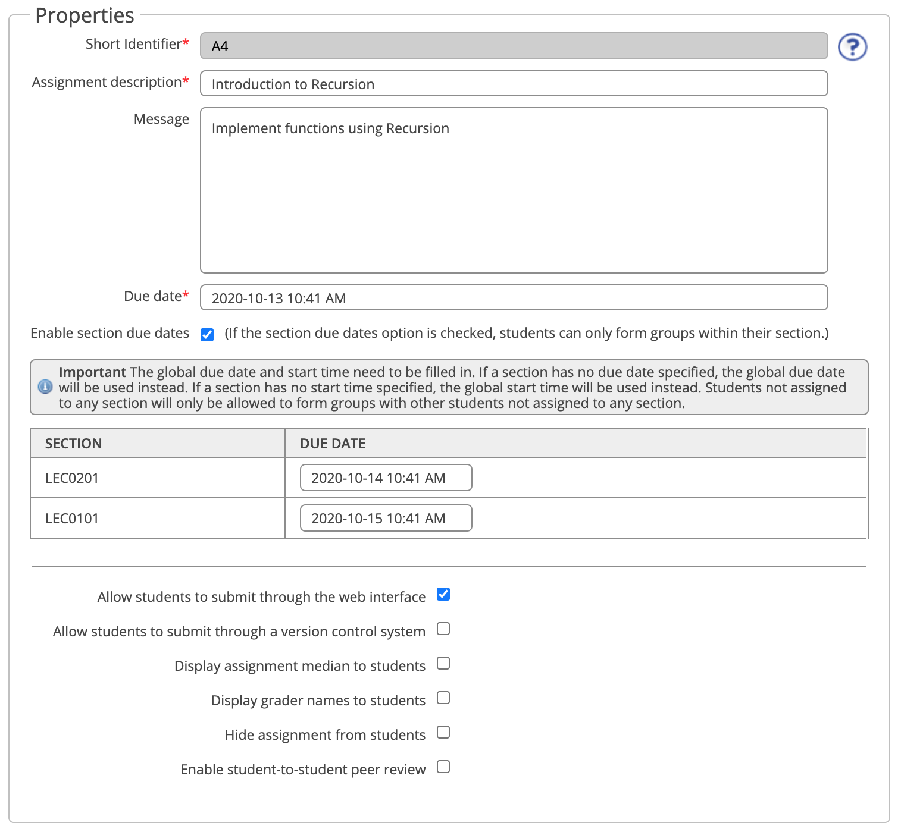

# Setting Up an Assignment

## Table of Contents:
 - [Initial Setup](#initial-setup)
    - [Properties](#properties)
    - [Required Files](#required-files)
    - [Group Properties](#group-properties)
    - [Late Submission Policy](#late-submission-policy)
    - [Re-mark Requests](#re-mark-requests)
    - [Saving Changes](#saving-changes)
 - [What Students Will See](#what-students-will-see)
 - [Modifying An Assignment After Creation](#modifying-an-assignment-after-creation)

## Initial Setup
To create a new assignment navigate to the "Assignments" tab at the top of the MarkUs website.

Click on the "Create Assignment" button under Manage Course Work.

You will be taken to the initial set-up page for an assignment on MarkUs. From this page you will be able to create and edit a new assignment for your class.

### Properties
This section allows you to set the name and due date for the assignment as well as enable (or disable) a few features you would like your assignment to have. All properties except for the Short Identifier may be changed after creation.

**1. Short Identifier**: This is the title that will be used in MarkUs menus and will be the default repository name. Because it is used as a directory name, ensure that it does not contain any spaces.
**2. Assignment description**: This is the longer, more descriptive name of the assignment used as its full title.
**3. Message**: This section allows you to include any additional information the students may need to know about the assignment.
**4. Due Date**: This section lets you set the due date for the assignment. You are able to configure the time (down to the minute) at which you would like the assignment to be due. The due date will be visible to students when they view the assignment. Note that the due date may be changed later on (ex/ to accommodate class-wide extensions). Changing the due date after submissions have been collected will not affect submitted assignments.
**5. Section Due Dates:** Checking the "Enable section due dates" box will allow you to set different due dates for different lecture sections. Note that if a due date is not specified the time in the "Due Date" section will be used by default.
> :spiral_notepad: **NOTE:** Students not assigned to any section will only be allowed to form groups with other students not assigned to any section.

**6. Check boxes:** The rest of this section includes check boxes that may be selected or deselected depending on your preferences. Note that in order for students to submit online, the "Allow students to submit through the web interface" box must be checked. If you prefer students to submit through a version control system, then uncheck the "web interface" box and select "version control system".

Please see the [Peer Review](Instructor-Guide--Assignments--Peer-Review.md) page for more information on Peer Review.

### Required Files
This section will allow you to specify the names of files that students will be required to submit:

 - You may add a required file by clicking on the "Add a Required File" link and specifying a name.
 - You may add as many required files as you need and may also delete specific files by clicking the "Delete" link next to the file you'd like to remove.
 - If you want your required file to be of a specific type (ex/ a text file, an image, etc.), then that may be specified by adding the file's type extension at the end of the name.
 - If you want students to only be able to submit files with the correct file names and extension types, then select the "Only allow students to submit the required files" checkbox. When this is checked, students will see a warning message and will be unable to submit files that do not match the required names and types.

### Group Properties
This section allows you to enable and configure settings for students to work in a group:

 - If this is the first assignment (or the first assignment with group work) then the "Students can work in groups" box must be selected to allow groups to be formed on MarkUs. Once checked, it will open up a new box with further settings. These settings include a "Students may form their own group" box which will allow students to create and invite other students to their group.
 - You may specify a minimum and maximum number of students per group.
 - Group names are always auto-generated if students are forming their own groups.
 - You can create groups manually or by uploading a file in the "Groups" tab once an assignment has been created (please see the "[Managing Group Members](Instructor-Guide--Groups.md)" page for more information).

 - If the "Persist groups from previous assignment" box is selected, then a previous assignment must be selected from the drop down list. This list is automatically populated from any previously created assignments for the course. Checking this option will allow you to use the same groups and group repositories from previous assignments. See the "[Managing Group Repositories](Instructor-Guide--Groups.md)" page for more information.

 - If you would like to see what students need to do to form their own groups once you have configured all the settings, please see the "[How Students Form Groups](Student-Guide.md)" page.

### Late Submission Policy
By default, no submissions after the assignment deadline are collected for grading.
However, MarkUs supports a few different late submission policies, which you can read about in [Late Submission Policies](Instructor-Guide--Assignments--Late-Submission-Policies.md).

### Re-mark Requests
This section lets you choose if you wish to allow re-mark requests. If you do, then a re-mark request due date may be specified by choosing a date from the drop down calendar. Specific instructions for the students may also be included in the "Remark Request Instructions" section.

### Saving Changes
Once all the required fields are completed (along with any other fields you choose to fill out), click the `Submit` button at the bottom of the change to create the assignment.

If an assignment is created in error or you wish to delete an assignment, this can be done by navigating to the "Properties" tab of the assignment you wish to delete and checking the "Hide assignment from students" box:

Although this does not delete the assignment from your dashboard, it does remove it from all of the student accounts. Students will neither be able to see nor access deleted assignments.

## What Students Will See
To get an idea of what an assignment looks like from the student's perspective check out [this page](Instructor-Guide--Student-View.md)!

## Modifying an Assignment After Creation
Once an assignment has been created, you are still allowed to modify most of the fields from the "Create Assignment" page that you just filled out. This can be done by navigating to the "Assignments" (1) tab, clicking on the assignment you wish to modify, and then clicking on the "Settings" (2) and then "Properties" (3) tabs:

All the fields on this page are the same as the ones from the "Create Assignment" section.
