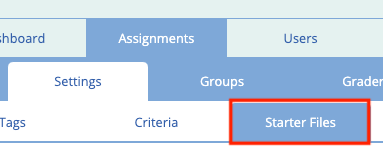
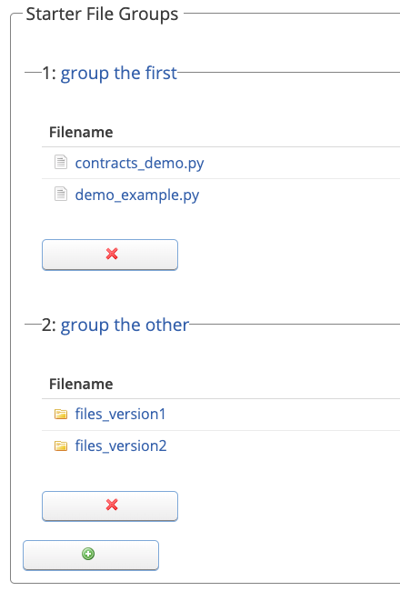
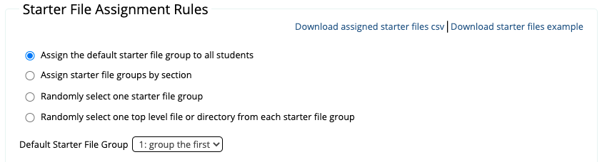
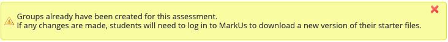

# Remark Requests

## Table of Contents:
- [How it Works](#how-it-works)
- [Uploading Files](#uploading-files)
- [Creating Rules](#creating-rules)
- [Managing Changes after the Assignment has Started](#managing-changes-after-the-assignment-has-started)
- [See Assigned Starter Files](#see-assigned-starter-files)

## How it Works

Starter files are files that will be available to students once they create their group for a given assignment. This allows instructors to easily distribute instructions and template files to students for their assignment.

While setting up an assignment, an instructor can upload starter files. Ideally this should be done before any groups have been created (see the [Managing Changes](#managing-changes-after-the-assignment-has-started) section if you wish to modify these files after groups have been created).

The instructor can also specify how these uploaded files should be distributed to the groups.

Starter files can be uploaded and configured from the "Starter Files" tab for a given assignment:

## Uploading Files

[Files can be uploaded](./General-Usage#using-the-file-manager) in the "Starter Files Groups" section of this page:

New groups can be created by clicking the green + button and removed by clicking the red :X: button.

Groups can be renamed by clicking the group's name (ex. click "group the first" to change the first group's name in the example above).

You may choose to upload your starter files to a single group or multiple groups as required by the [rules](#creating-rules) you specify.

## Creating Rules

Once starter files have been uploaded you may choose how they will be distributed to each group using the "Starter File Assignment Rules" section:

- Assign the default starter file group to all students
    - select one starter files group as the default, these files will be given to all newly created groups
- Assign starter file groups by section
    - for each section, select a starter files group to assign. Once a group is created, the section that the members belong to will determine which starter files they receive.
- Randomly select one starter file group
    - when a new group is created, randomly select one of the starter file groups and give all the files in that group.
- Randomly select one top level files or directory from each starter file group
    - when a new group is created, randomly select one top level file (or directory) from each starter file group to give to the new group.
    - if you wish you can choose to rename the files (or directories) when they are copied to the new group's repository. For example, you may not want the students to know which version of the starter files they received so you may choose to rename the directories in "group the other" to simply "files". The students, would then receive a directory containing either the content of "files_version1" or "files_version2" but the name of the directory they would see is just "files". (Select this option to see the renaming interface).

## Starter File Visibility

The "Starter files are available to students after the due date has passed" checkbox indicates whether students are allowed to view download starter files after the assignment due date has passed. If the box is unchecked, students will be prevented from downloading starter files once the due date has passed. This includes all extensions due to late policies and grouping extensions.

For timed assessments, starter files will not be visible until the student has started the assessment. If the student never starts the assessment on time and the "Starter files are available to students after the due date has passed" checkbox is checked, then students will be able to download starter files after the last start time has passed.

## Managing Changes after the Assignment has Started

If a group has already been created for this assignment and you modify the starter files on this page you will see a warning at the top of the page:

Students may choose to download the new version of their starter code (with any additional changes applied) when they view [the assignment on MarkUs](./Student-Guide
).

If you make changes to the starter files themselves (ie. adding/removing/modifying files) only those students who have been assigned starter files that have changed will see this warning. On the other hand, if you make a change to how starter files are distributed (ie. make a change to the "Starter File Assignment Rules" form), all students will be notified of the change.

If you make changes to starter files or changes to how the files are distributed, MarkUs will do its best to make sure that any groups that already have assigned starter files already change as little as possible. For example, if the current starter file rule is "Assign the default starter file group to all students" and a group has been created already, changing the starter file rule to "Randomly select one starter file group" will leave the group with the starter files they have already been assigned instead of randomly choosing them new ones. However, any new groups that are created from that point on will be assigned a group randomly. This is to minimize the changes to starter files that any single group will see.

In order to avoid these changes entirely, it is highly recommended that you finalize your starter files and the starter file rules before any groups are created.

If you make changes to the starter files it is highly recommended that you tell your students that they must log in to MarkUs to download the new version of the starter code.

## See Assigned Starter Files

After students have started to create groups for the assignment, you can see which groups were assigned which starter files by clicking the "Download assigned starter files csv" link. This will download a csv file mapping the group to the starter file (or directory) assigned to that group.

This is useful when using either of the "random" rules to see how the files were distributed.

## Download example starter files

Students will be able to download the starter files according to the starter file rules you have set on this page. If you would like to download an example of these starter files, click the "Download starter files example" link (in the "Starter File Assignment Rules" section).

Note that if the rules that you have chosen involve randomly assigning files, each time you click the link you may get different files.
