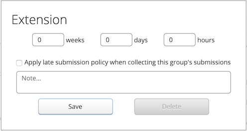

# Managing Group Members

## Table of Contents
 - [Manage Groups Page](#manage-groups-page)
 - [Groups Actions](#groups-actions)

## Manage Groups Page
Groups can be managed from the "Groups" tab under "Assignments".

This page allows admin users to create and remove existing groups for a given assignment, add and remove students from groups, and give extensions to individual groups.

## Groups Actions

### View Students

The table on the left side of the page contains the names of all students in the course. The "Assigned?" column shows whether the student has been assigned to a group for this assignment.

### View Groups

The table on the right side of the page contains the names and memberships of all groups currently created for this assignment.

### Create All Groups

This option is available if the ["Students can work in groups"](Instructor-Guide--Assignments--Setting-Up.md#group-properties) checkbox is not selected. Clicking the "Create All Groups" button will create a group for all students that are not already in a group for this assignment. Each group created in this way will contain only one member.

### Use Another Assignment's Groups

If groups have been previously created for another assignment, you can choose to use the same groups for the current assignment by clicking the "Use another assignment's groups" link.

This will open a modal where you can select another assignment. By clicking "Save" all groups will be copied from the selected assignment.

### Create Group

Clicking the "Create Group" button will create a single empty group.

### Add Student(s) to Group

Selecting one or more students from the left hand table and a single group from the right hand table and clicking "Add student(s) to group" will add those students to the selected group. Note that student may not already be a member of another group for this assignment.

### Delete Group(s)

Selecting one or more groups from the right hand table and clicking the "Delete group(s)" button will either:

- Delete the group entirely students have not yet submitted any work
- Remove all students from that group if there is submitted work (this ensures that the submitted work is not lost permanently)

### Remove an individual student from a group

Clicking the red X beside the student's name in the "Members" column on the right hand table will remove them from the group.

### Change a group's name

Clicking the pencil icon beside the group's name in the "Group" column on the right hand table will allow you to edit the name of the group.

### Give a group an extension

Clicking the + icon in the "Due Date Extension" column on the right hand table will open up a modal which will allow you to give this group an extension beyond the due date for this assignment.

Extensions can be specified in any combination of weeks, days, and hours. Additionally, you may choose to apply late penalties on top of this extension (or not) by clicking the "Apply late submission policy when collecting this group's submissions" checkbox. Notes may also be added which are only visible to admins.

To edit an existing extension for a group, click the link in the "Due Date Extension" column that replaces the + icon once an extension has been added.

> :spiral_notepad: **Note:** Duration extensions can also be specified here for [Timed Assessments](Instructor-Guide--Timed-Assessments.md). Duration extensions are specified in hours and minutes.
