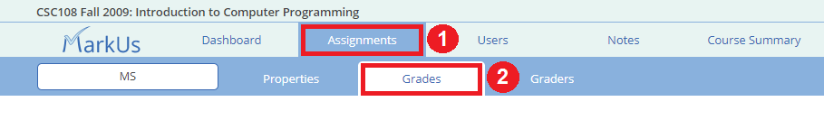
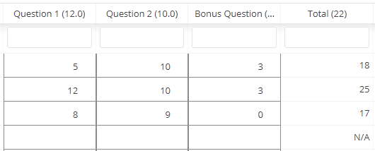

# Using a Marks Spreadsheet

## Table of Contents:
 - [Grades Tab](#grades-tab)
     - [Columns](#columns)
     - [Releasing Marks](#Releasing-marks)
     - [Unreleasing Marks](#unreleasing-marks)
 - [Graders Tab](#graders-tab)

> :spiral_notepad: **NOTE:** Make sure you have read the [set-up page](./Instructor-Guide--Marks-Spreadsheets--Setting-Up) for marks spreadsheets before proceeding with this section.

## Grades Tab
In the grades tab you will be able to interact with your created spreadsheet. To navigate to to the "Grades" tab of your spreadsheet click on Assignments -> Grades:

The grades tab will automatically load all the active students in your course into the spreadsheet. If you wish to display inactive students as well, click on the "Display inactive students" checkbox at the top of the page.

### Columns
The marks spreadsheet contains a number of columns:

* **User Name:** Contains the username of the student (the name they use to log into MarkUs)
* **Section:** Contains the lecture section of the student. If no lecture section has been specified, then the field will be blank. Students may be placed into lecture sections from the "Users" page (See the "[Users](./Instructor-Guide--Users)" page for more information).
* **First Name:** The first name of the student.
* **Last Name:** The last name of the student.
* **Column(s):** This is the main feature of the spreadsheet. You will now see the columns that you have created previously:

    * Each column will list its name (i.e. "Question 1") and the mark associated with the column (i.e. 12.0).
    * At the very end of your specified columns will be the "Total" column **if you checked the "Show total" checkbox in the [set-up](./Instructor-Guide--Marks-Spreadsheets--Setting-Up) section**. The total column will have the sum of the **non-bonus mark columns** in parentheses.
    * The columns will all start empty and you may add in values for each student depending on their mark for each column. Negative values are not allowed however you may include values greater than what was specified for the column.
    * You may not modify the "Total" column.
    * The values in the table will save on their own and you do not have to press any special save button.
* **State:** Contains the release state of the spreadsheet. Possible values are "blank" if the student's marks have not been released yet or "Released" if they have.

### Releasing Marks
Once you create a spreadsheet, students will be able to see that there is a spreadsheet for their course but they will not be able to see their individual marks until you release them. To do this, click the checkbox of the rows of the students who's marks you'd like to release. You may select all the rows at once by clicking the top left checkbox and then click on the "Release Marks" button:

The "State" column should now say "Released" for all the marks that have been successfully released (you may need to refresh the page). Once this procedure is complete the students will be able to see their marks for each column and their total (if specified).

### Unreleasing Marks
Once a spreadsheet row has been released to a student, the student's column marks may not be changed. However, if you wish to modify their marks, you may unrelease their marks by selecting the rows again and clicking the "Unrelease Marks" button.

## Graders Tab

See [this page](./Instructor-Guide--Assignments--Assigning-Graders) for instructions on how to assign graders.

## TODO
 - [x] Insert Link to "users" page under "columns"
