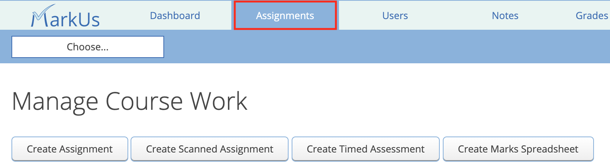

# Setting Up a Marks Spreadsheet

## Table of Contents:
 - [Setup](#setup)
     - [Properties](#properties)
     - [Columns](#columns)
 - [Save](#save)

## Setup
***Marks Spreadsheets provide the instructor a way of keeping a record of student's marks for assignments, quizzes or tests that do not require online submission.*** For example, an instructor may wish to set up a spreadsheet for a midterm and include a mark for each question on the test.

To set up a marks spreadsheet navigate to the "Assignments" tab of MarkUs and click on the "Create Marks Spreadsheet" button:

This will bring you to the "Create Marks Spreadsheet" page where a few customization options are available.

### Properties
This section allows you to configure some display settings of your spreadsheet:

**1. Short Identifier:** This is the short title of the spreadsheet that will appear in the drop down list of assignments.
**2. Description:** This is the longer, more descriptive name of the spreadsheet used as its full title.
**3. Message:** This section allows you to include any additional information the students may need to know about the spreadsheet.
> :spiral_notepad: **NOTE:** Anything written in the message section will be displayed to the students regardless of marks being released.

**4. Date:** This section lets you give a date to the spreadsheet. Once a date has been given and the spreadsheet created, you may select the "Remove date" check box. This will remove the date from being attached to the spreadsheet once updated. If you wish for there to be no date, you may also simply leave this field blank.
**5. Show total:** Check this box if you wish for there to be a column that adds up all of each student's marks on the spreadsheet.
**6. Hide Spreadsheet:** Check this box if you wish for the spreadsheet to be hidden from students.
> :spiral_notepad: **NOTE:** Even if you check this box, the spreadsheet will still be visible to graders.

### Columns
In this section you may specify the columns (or marks) that you wish your spreadsheet to have:

To add a new column, click on the "Add a column" hyperlink at the bottom of the page. In each column you may specify:

**1. Name:** The name of the column (e.g. Question 1, Part 1, Style, etc.). You can also think of this as the name of the specific criterion.
**2. Out of:** The number of marks associated with the criterion. The value in this field must be a whole number (0, 1, 2, 3...) and cannot be negative.
**3. Bonus Mark:** Check this box if you wish for the column to be a bonus mark column.
**4. Delete:** Check this box and select "Update Marks Spreadsheet" to remove the column from the sheet.

## Save
Once you have finished configuring your spreadsheet, don't forget to hit the "Update Marks Spreadsheet" button to create/save your spreadsheet!

Please see the [usage](Instructor-Guide--Marks-Spreadsheets--Assigning-Marks.md) page for information on how to use the spreadsheet to grade your students.
