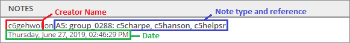
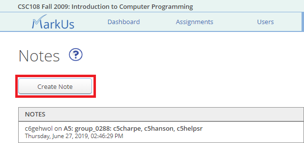
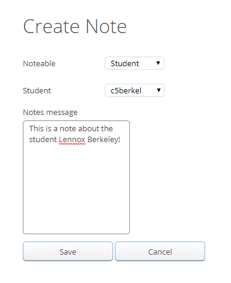
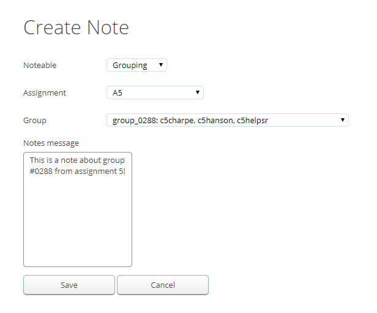
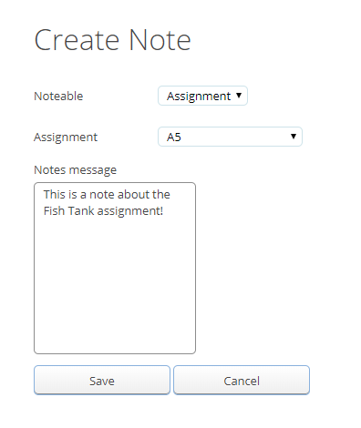
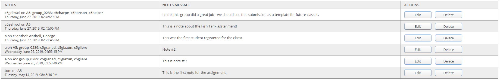

# Notes

## Table of Contents
 - [Notes Page](notes-page)
 - [Note Types](note-types)
     - [Student Note](student-note)
     - [Grouping Note](grouping-note)
     - [Assignment Note](assignment-note)
 - [Notes Table](notes-table)

## Notes Page
The notes page can be accessed by clicking on the notes tab at the top of the home screen.

The notes page allows you to see all the notes that have been created for the course. Notes may be created by graders or admin and are visible to both the graders and the admin but NOT the students. When a note is created it will display the name of the creator, the note type (and what/who it references) as well as the date of creation:

To create a note, click on the "Create Note" button at the top of the page:

Doing so will bring you to the "Create Note" page where you may choose one of the three different types of notes to create.

## Note Types
There are three different types of notes: student notes, grouping notes and assignment notes.

### Student Note
A student note allows a grader or an admin to create a note about a specific student. To create a student note, select the "Student" option from the "Noteable" drop-down list of the "Create Note" page:

From here you will be able to select which student you would like to make the note about and add a note message.

### Grouping Note
A grouping note allows a grader or an admin to create a note about the submission of a specific group from a specific assignment. To create a grouping note, select the "Grouping" option from the "Noteable" drop-down list of the "Create Note" page:

From here you will be able to select the assignment and the group to which the note applies. Note that the group must have already been created for it to appear in the drop down list. Please see TODO INSERT LINK TO CREATING A GROUP PAGE for more information on creating groups. If groups are not allowed then the "Group" drop-down list will simply show a list of all the active students.

### Assignment Note
An assignment note allows a grader or an admin to create a note about an entire assignment. To create an assignment note, select the "Assignment" option from the "Noteable" drop-down list of the "Create Note" page:

From here you will be able to select the assignment to which the note applies and add a note message.

> :spiral_notepad: **NOTE:** Every note type is able to be created from this page. However, the only type of note that is able to be created NOT on the notes page is a grouping note. Please see the [notes](./Instructor-Guide--Assignments--Marking--Grading-View#notes) section of the "Marking an Assignment" page for detailed instructions.

## Notes Table
After a note has been created in the "Create Note" section it will appear along with any other note that has been created in the notes table:

The notes table gives the note information in the first column, the note description in the second and the option to delete or edit the note in the last column. Admins may edit or delete ANY note that has been created while graders may edit or delete only notes that they have created.
