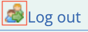
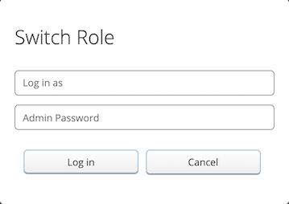

# Student View

## Table of Contents:
- [View as Another User](#view-as-another-user)

## View as Another User

An admin user can choose to view MarkUs from the perspective of a student or grader user by selecting the "Switch Role" icon.

This icon can be found at the top right corner of any page in MarkUs. If a "Log Out" link is visible, the icon can be found beside that link.

Clicking on the "Switch Role" icon will open a modal. To switch perspectives, type the username of any student or grader user in the "Log in as" field and your own password in the "Admin Password" field.

To switch back to the regular (admin) view. Click the same icon and this time type in your own username and password.
