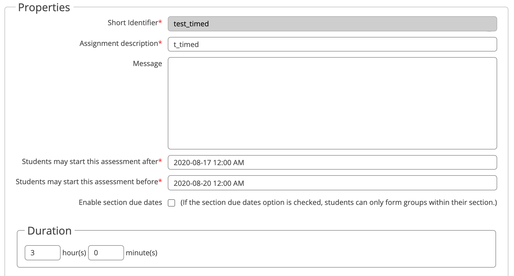

# Timed Assessments

## Table of Contents
- [How it Works](#how-it-works)
- [Creating and Updating](#creating-and-updating)
- [How Extensions and Penalty Periods Interact](#how-extensions-and-penalty-periods-interact)

## How it Works

Timed assessments differ from regular assignments in that they do not have a fixed due date before which a student must complete the assignment. Instead the instructor specifies a range of times between which the student must start the assignment. After the student has started the assignment, they have a specified number of hours and minutes to complete the assignment before it is due.

For example, a timed assessment may specify a 24 hour period when an assignment must be completed and may give a student 2 hours to complete it. A student may choose to start the assignment at 11am (during that 24 hour period) and will therefore have until 1pm to finish. Another student may choose to start at 3pm and therefore will have until 5pm.

## Creating and Updating

A new timed assessment can be created from the Assignment tab by clicking the "Create Timed Assessment" button.

Most of the options when creating a timed assessment is the same as making a regular assignment and those details are covered [here](./Instructor-Guide--Assignments--Setting-Up).

The "Properties" section contains three relevant sections that differ from a regular assessment:

- students may start this assessment after
	- the earliest a student may start this assessment
	- this can be set differently for different sections
- students may start this assessment before
    - the latest a student may start this assessment (they will still have the full duration to complete it without penalty)
    - this can be set differently for different sections
- Duration
	- the amount of time a student has to complete the assessment once they have started.

## How Extensions and Penalty Periods Interact

If a [late submission policy](./Instructor-Guide--Assignments--Late-Submission-Policies) has been set, the policy will be applied after the duration has expired.

For example, if a timed assessment has a duration of 2 hours and a policy that deducts 10% for the first hour past the due date. A student who submits after 2.5 hours will receive a 10% penalty.

If a group has been given an [extension](./Instructor-Guide--Groups#give-a-group-an-extension) for this timed assessment, the extension will also apply after the duration.

For example, a group with an extension of 1 hour for a timed assessment with a duration of 2 hours will have 3 hours to complete the assessment without penalty.
