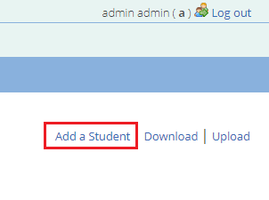
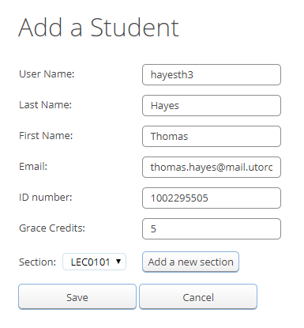
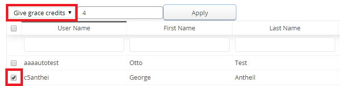
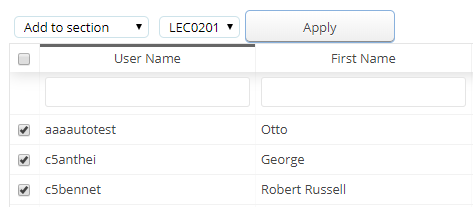
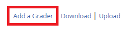
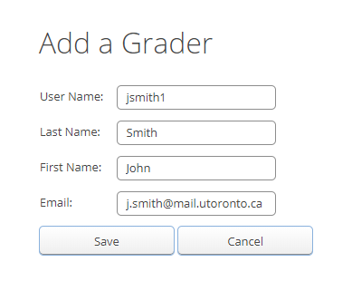
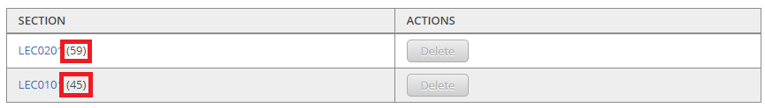
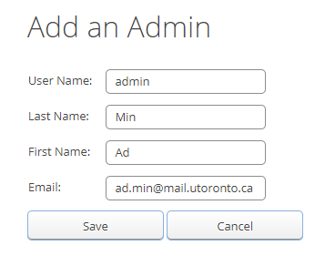

# Managing Users

## Table of Contents
 - [Student Accounts](#student-accounts)
     - [New Student Account](#new-student-account)
     - [Grace Credits](#grace-credits)
     - [Other Actions](#other-actions)
 - [Grader Accounts](#grader-accounts)
 - [Sections](#sections)
 - [Admin Accounts](#admin-accounts)

> :warning: **Warning**: Do not change the username of any users after they have been created. This will prevent that user from logging in unless their log in credentials change as well. If you need to change the username of a user, make sure you let your sysadmin know so that they can make the appropriate changes.

## Student Accounts

### New Student Account
To add a new student, navigate to the Students tab of MarkUs (Users -> Students)

Once here, you will see a table with all the students listed for your course. The table will give you all the student's basic information as well as the number of grace credits they have left and whether or not they are Active or Inactive.

To add a new student click on the "Add a student" link at the top right hand corner of the page:

This will bring up the "Add a Student" page:

The page contains the following fields to be filled out:
 **- User Name:** The student's username (used to log in).
 **- Last Name:** The student's last name.
 **- First Name:** The student's first name.
 **- Email:** The student's email address.
 **- ID number:** The student's student number (optional).
 **- Grace Credits:** The number of grace credits you'd like the student to have (if you'd like them to have none or are not using grace credits enter 0).
 **- Section:** The section the student is in (you may also create a new section from here) (optional).

Once you've filled out the required fields, don't forget to hit save to create your student account!

If you wish to modify a student account that has already been created, click on the "Edit" hyperlink and you will be brought to the student's "Edit a Student" page (same as "Add a Student").

### Grace Credits
Grace credits are used to allow students to [extend assignment deadlines](Instructor-Guide--Assignments--Late-Submission-Policies.md#automatically-deduct-grace-credits).

To modify the number of grace credits a student has, select the student's check box from the left hand side of the page. If you need to modify a group's total, make sure you select all the students in the group. Then, make sure you have the "Give grace credits" action selected from the drop down menu:

You may input the number of grace credits you'd like to add to the student's total. **You may enter a negative number to take away grace credits from a student.** Even if a student already has the max number of grace credits (ex/ 5/5) you may still give them more (the numerator and denominator will simply both increase).

A count of the number of grace credits a student has left can be seen in the "Grace Credits" column of the Students table.

### Other Actions
Three actions other than assigning grace credits may be performed from the drop down menu:
 **- Add to section**: This allows you to add the selected student(s) to the specified lecture section.

 **- Mark as inactive:** Sets the selected student(s) status to inactive.
 **- Mark as active:** Sets the selected student(s) status to active.

Don't forget to click the "Apply" button to save your changes.

## Grader Accounts
To set up a "Grader" account avigate to the "Users" section of MarkUs and click on the "Graders" tab

This page allows you to view a table of all the current graders set up for this course. Each row of the table includes the grader's username, first and last name(s), an email address and an actions column. To add a new grader click on the "Add a Grader" link on the top right hand corner of the page:

This will take you to the "Add a Grader" page where you will be able to fill in the necessary fields to create a new grader account:

Note that a username, a first name and a last name are required for the account to be created but an email address is NOT required.

Once you have added a grader, their information will show up in the table with the rest of the graders for this course.

If you wish to edit or delete a grader, then select either the "delete" or "edit" link of the grader's specific row.

The "delete" link will remove the user from the database and the "edit" link will bring you to a page similar to the "Add a Grader" page.

## Sections
The "Sections" tab allows you to manage the lecture sections for your course. To add a new lecture section, first navigate to the "Sections" tab of MarkUs (Users -> Sections).

Here you will see a list of all the lecture sections currently created for your course. The number in parentheses following each section represents the number of students in that section:

To add a new section, click on the "Add a new section" button at the top of the page. This will allow you to enter the name of a new section and then save it. Once this has been done you may add students to that section in the "[Students](#other-actions)" tab.

Clicking on the name of the lecture section will allow you to see a list of all the students currently in that section.

## Admin Accounts
To see a list of all the admin accounts associated with the course, navigate to the "Admins" tab (Users -> Admins).

Here you will see a table with all the admin information. If you wish to edit admin information, click on the "Edit" hyperlink under the "Actions" column. You are allowed to change your username here but must request a password change from the system admin.

To add an admin account, click on the "Add an Admin" hyperlink in the top right hand corner of the page. You will be brought to the "Add an Admin" page where you may fill out the required information:

Don't forget to hit the save button when you're finished!
