# Student Guide

## Table of Contents
- [How to Form Groups](#how-to-form-group)
- [Download Starter Files](#download-starter-files)
- [Submitting Work for an Assessment](#submitting-work-for-an-assessment)
- [View Results](#view-results)
- [Submit a Remark Request](#submit-a-remark-request)
- [Timed Assessments](#timed-assessments)
- [Email Settings](#email-settings)
- [Key Pairs](#key-pairs)

## How to Form Groups

After navigating to the appropriate assignment, click the `Create Group` button to create your group:
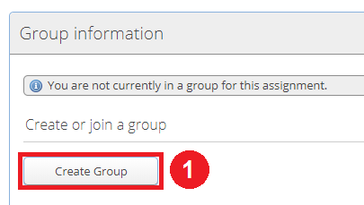

You may then choose to invite other group members using the "Invite Student(s)" button:
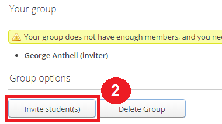

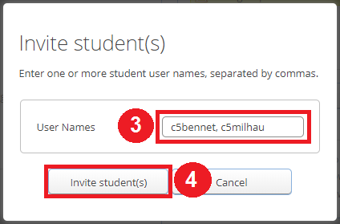

If a student is not eligible to be a part of your group, you will receive a warning:
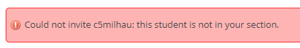

Once you have invited someone, they will appear under the "Group invitations" list but will have a pending status until they accept the invitations. Invitations can be accepted by clicking the "Join Group" button or declined by clicking the "Decline Invitation" button.
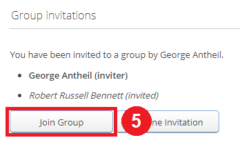

Once a group meets the minimum member requirements for the assignment, you will be allowed to submit files for the assignment.

> :warning: **WARNING** When adding other students to a group, the inviter must type in their teammate's exact username (case sensitive) not their first/last name.


## Download Starter Files

If starter files have been provided for an assignment, they will be available when on the Assignment page.

You can download the starter files by clicking the "Download" file in the "Starter Files" section of the Assignment page:

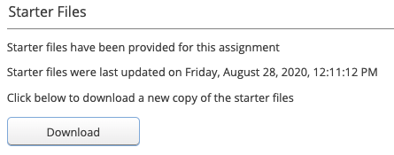

If your instructor has changed the starter files _since the last time you downloaded it_, you may see a warning at the top of the page:

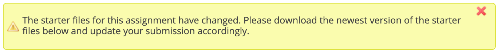

If you see this warning message you may want to download the new copy of the starter files.

## Submitting Work for an Assessment

To submit work for an assessment, first select the assignment from the table on the Home page.

### Submit on the website

Navigate to the Submissions page by clicking the "Submissions" tab. From this page, you should be able to upload and download files using the [file manager](./General-usage#using-the-file-manager).

You can also view a preview of the files you have already submitted by selecting the file on the file manager table.

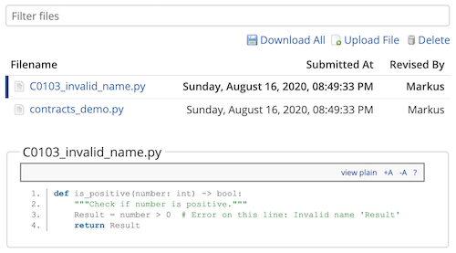

If you are missing some required files, a list of missing required files will be included as a warning at the top of the page.

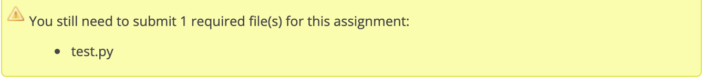

### Submit through version control (git)

If your instructor has enable submission through version control you will see a section called "Group repository URL" on the Assignment page. You may use this url to clone your repository for the given assignment.

The repository will have the following structure:

```
group_name/
├── markus-hooks/
│   └── ...
├── assignment1/
│   └── some_file.txt
└── assignment_other/
    └── other_file.py
```

Where:

-  `group_name` is the name of your group for this assignemnt.
- `markus-hooks` is a directory containing git hooks used by MarkUs, do *not* modify this directory or its content.
- all other directories are named after assignments available to your group. In this case, the assignments are named `assignment1` and `assignment_other`.

> :warning: **Warning:** You may only add/remove/modify files in the assignment subdirectories. Any commits that contain changes to any other file will be rejected by MarkUs when pushed.

> :arrow_forward: **EXAMPLE:**
> To submit a file to `assignment_other`, create a file in the `assignment_other/` subdirectory and push the changes back to MarkUs.

## View Results

Once your submssion for an assignment has been marked, the Result tab will become visible for your assignment. Click this tab to show the detailed results for this assignment. On this page you can:

- See the files you submitted from the "Submissions files" tab.
    - If annotations have been left by graders, these will be visible by hovering over highlighted sections of the submitted files.
- See a list of all annotations from the "Annotations" tab
- Submit a [remark request](#submit-a-remark-request) (if available) from the "Remark Request" tab.
- See your mark for this assignment broken down by criteria from the "Marks" tab.
- See a summary of your marks (including any bonuses or deductions) as well as any notes or overall comments on the "Summary" tab.

## Submit a Remark Request

If your instructor has enabled remark requests for your assignment *and* the deadline to submit remark requests has not yet passed, you can submit a remark request from the "Remark Request" tab on the [Results](#view-results) page.

Start by writing a message in the text box explaining why you are submitting the request. You may save your message at any time and come back to it later.

When you are ready to submit the request click the "Send" button. The remark request will now be visible to your instructor and any graders. Once the instructor has had a chance to review your request they may respond. Their response will be visible on the "Remark Request" tab and changes to your marks (if any) will be visible from on the "Marks" tab.

You may cancel a remark request at any time from the "Remark Request" tab.

## Timed Assessments

Timed assessments differ from regular assignments in that they do not have a fixed due date before which you must complete the assignment. Instead the instructor specifies a range of times between which the you must start the assignment. After you have started the assignment, you will have a fixed number amount of time to finish the assignment.

Before you can start the timed assessment you can still see the assignment details and [create a group](#how-to-form-group). On the main Assignment page you will see a "Timed Assessment" section which will tell you when you can start the assessment and how long you will have once you start. If you have been given an extension, it will be visible here as well.

Once you can start the timed assessment a "Start" button will become visible. Click this button to start the assessment. Once you click the "Start" button you will must complete and submit your work to MarkUs before the duration expires.

In the example below, a student will have exactly 3 and a half hours to complete and submit the assessment once they have clicked the "Start" button.

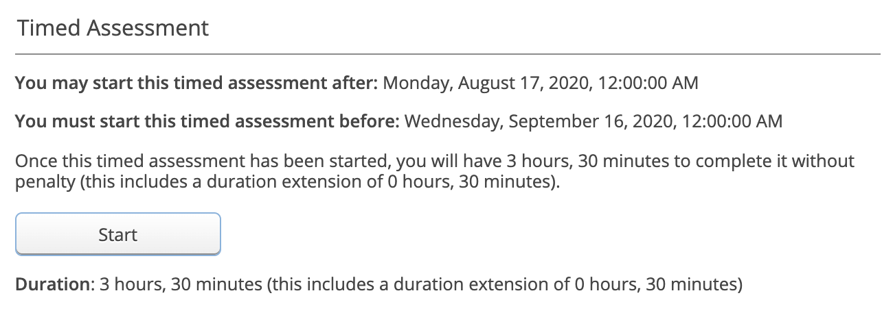

Once you have started the assessment, the "Submissions" tab will become visible and you will be able to [submit your work](#submitting-work-for-an-assessment) as normal.

You will also be able to see how much time you have left to submit:

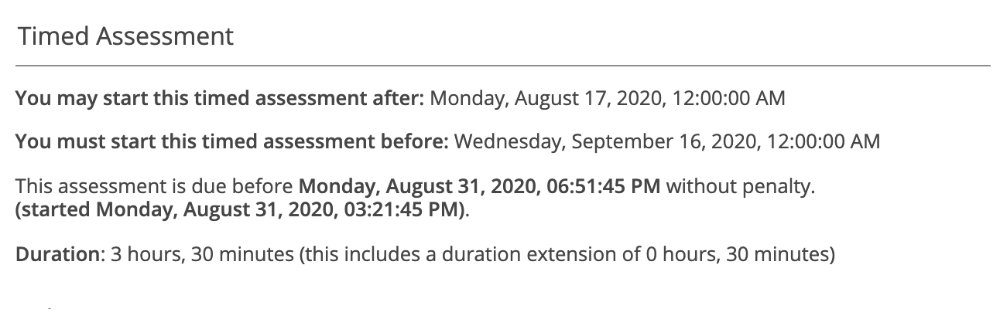

## Email Settings

If you wish to receive emails when the results of an asessment are released and/or if you are invited to a group, navigate to the "Settings" tab and enable either of these options. To enable one of the options, select one or both of the checkboxes and click "Update Settings".

## Key Pairs

If your instance of MarkUs is using git repositories to store student submissions, you have the option to upload a public key to MarkUs. This public key will be used to authenticate you when you clone a git repository from MarkUs over ssh.

To upload a public key, navigate to the "Key Pair" tab. Click on the "New Key Pair" link to upload a new key pair (as a file or as text) or click on an existing Key Pair to edit it. You may upload multiple public keys in this way.

For instructions on how to generate a public/private key pair see:

- [for Windows](./SSH_Keypair_Instructions_Windows)
- [for Linux and OSX](./SSH_Keypair_Instructions_Linux-OSX)
